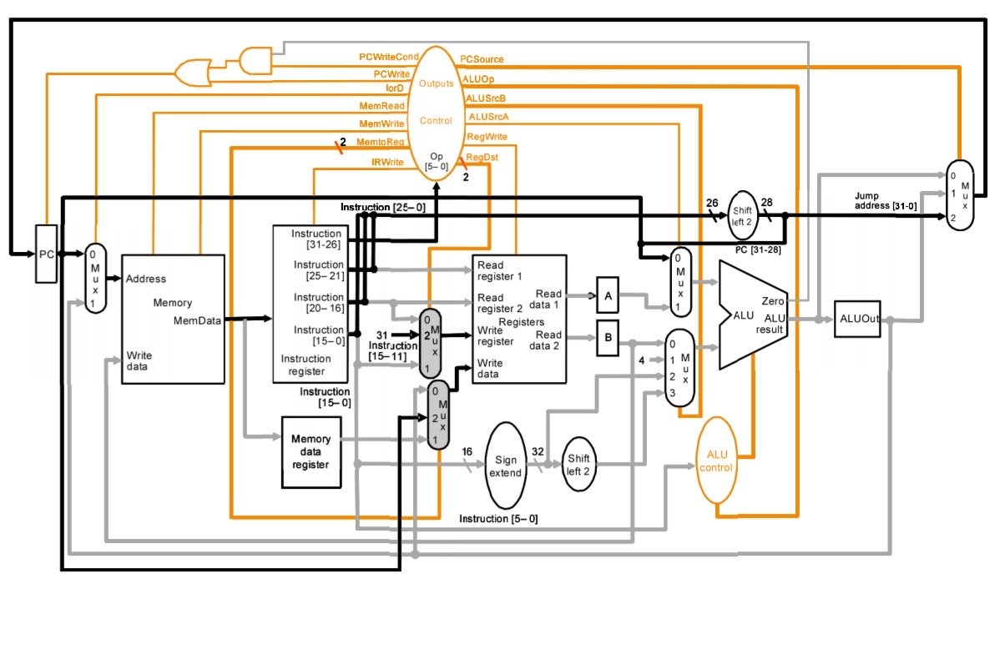
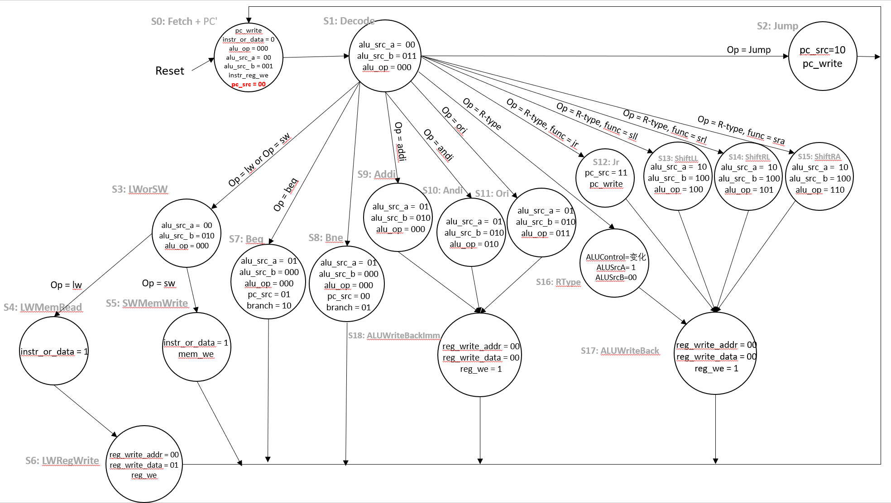
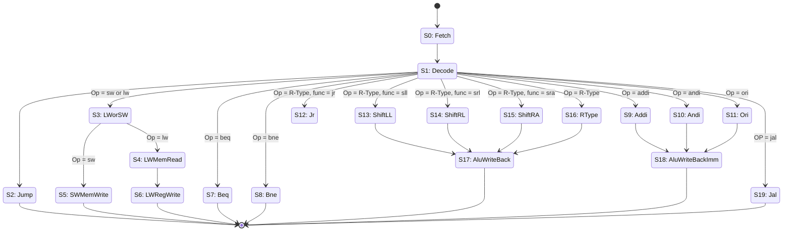
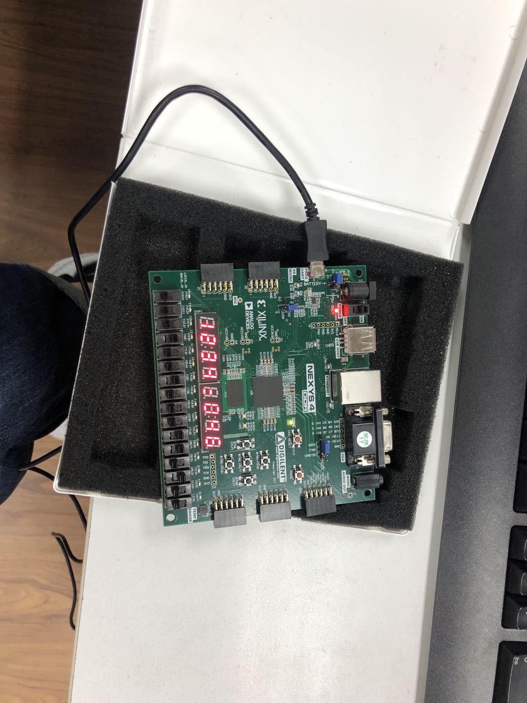
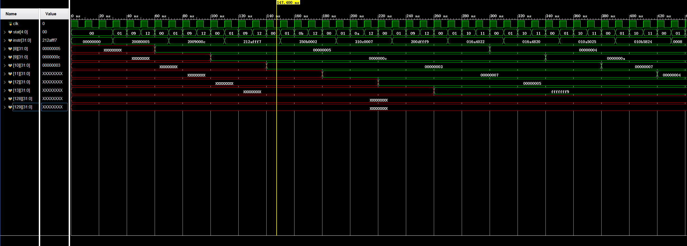
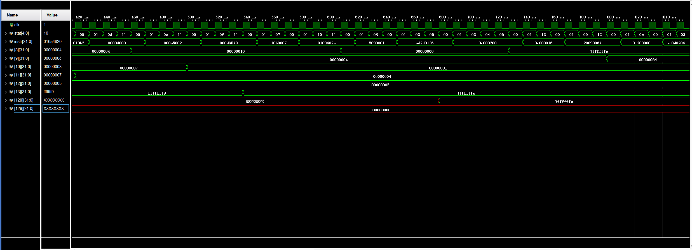
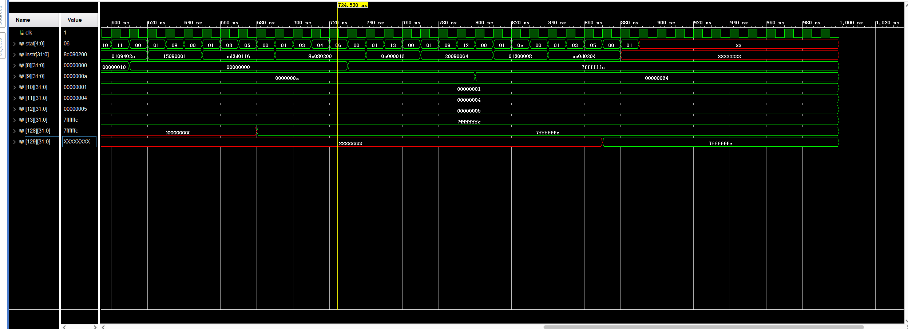

# Multi-Cycle CPU


32 位多周期 MIPS 指令集 CPU, 利用 systemverilog 编写

## 1. 设计原理

### 1.1 时间周期

多周期CPU指的是一条指令的执行在多个时钟周期内完成, 然后开始下一条指令的执行, 即一条指令用多个时钟周期完成. 电平从低到高变化的瞬间称为时钟上升沿, 两个相邻时钟上升沿之间的时间间隔称为一个时钟周期. 时钟周期一般也称振荡周期 ( 如果晶振的输出没有经过分频就直接作为 CPU 的工作时钟, 则时钟周期就等于振荡周期 ). 若振荡周期经二分频后形成时钟脉冲信号作为 CPU 的工作时钟, 这样, 时钟周期就是振荡周期的两倍. 

CPU在处理指令时, 一般需要经过以下几个步骤:

1. 取指令 (IF): 根据程序计数器 PC 中的指令地址, 从存储器中取出一条指令, 同时, PC 根据指令字长度自动递增产生下一条指令所需要的指令地址, 但遇到 "地址转移" 指令时, 则控制器把 "转移地址" 送入 PC, 当然得到的 "地址" 需要做些变换才送入 PC.

2. 指令译码 (ID): 对取指令操作中得到的指令进行分析并译码, 确定这条指令需要完成的操作, 从而产生相应的操作控制信号, 用于驱动执行状态中的各种操作.

3. 指令执行 (EXE): 根据指令译码得到的操作控制信号, 具体地执行指令动作, 然后转移到结果写回状态.

4. 存储器访问 (MEM): 所有需要访问存储器的操作都将在这个步骤中执行, 该步骤给出存储器的数据地址, 把数据写入到存储器中数据地址所指定的存储单元或者从存储器中得到数据地址单元中的数据.

5. 结果写回 (WB): 指令执行的结果或者访问存储器中得到的数据写回相应的目的寄存器中.

### 1.2 数据通路与主控制器状态转移图



下面这张图上的 state  标号还是有点问题的 ( 主要是老师画了一部分那部分标号我懒得改动了 ), 主要得看下面第二幅图的标号 ( 这张图是我在写代码前画的， 所以代码基本是抄这个上面的东西 )





## 2. MIPS 指令集

### 2.1 实现指令集

```text {.line-numbers}
add $rd, $rs, $rt   # [rd] = [rs] + [rt]
sub $rd, $rs, $rt   # [rd] = [rs] - [rt]
and $rd, $rs, $rt   # [rd] = [rs] & [rt]
or $rd, $rs, $rt    # [rd] = [rs] | [rt]
slt $rd, $rs, $rt   # [rd] = [rs] < [rt] ? 1 : 0
sll $rd, $rt, shamt # [rd] = [rt] << shamt
srl $rd, $rt, shamt # [rd] = [rt] >> shamt
sra $rd, $rt, shamt # [rd] = [rt] >>> shamt
addi $rt, $rs, imm  # [rt] = [rs] + SignImm
andi $rt, $rs, imm  # [rt] = [rs] & ZeroImm
ori $rt, $rs, imm   # [rt] = [rs] | ZeroImm
slti $rt, $rs, imm  # [rt] = [rs] < SignImm ? 1 : 0
lw $rt, imm($rs)    # [rt] = [Address]
sw $rt, imm($rs)    # [Address] = [rt]
j label             # PC = JTA
jal label           # [ra] = PC + 4, PC = JTA
jr $rs              # PC = [rs]
beq $rs, $rt, label # if ([rs] == [rt]) PC = BTA
bne $rs, $rt, label # if ([rs] != [rt]) PC = BTA
nop                 # No operation
```

其中使用的符号释义如下：

- `[reg]`：寄存器 `$reg` 中的内容
- `imm`：I 类型指令的 16 位立即数字段
- `addr`：J 类型指令的 26 位地址字段
- `label`：指定指令地址的文本
- `SignImm`：32 位符号扩展的立即数 ( `= {{16{imm[15]}}, imm}` )
- `ZeroImm`：32 位 0 扩展的立即数 ( `= {16'b0, imm}` )
- `Address`：`[rs] + SignImm`
- `[Address]`：存储器单元 `Address` 地址中的内容
- `JTA`：跳转目标地址 ( `= {(PC + 4)[31:28], addr, 2'b0}` )
- `BTA`：分支目标地址 ( `= PC + 4 + (SignImm << 2)` )

相对单周期多写了个 `jal`, 主要是发现这个莫名的好写, 而且写完后基本能跑大部分机器码了, 至于其他的比如 `bne` 系列的就懒得再写了, 和我写的没太大差别, 感觉没啥意思.

### 2.2 对应机器码格式

```
add:    0000 00ss ssst tttt dddd d--- --10 0000
sub:    0000 00ss ssst tttt dddd d--- --10 0010
and:    0000 00ss ssst tttt dddd d--- --10 0100
or:     0000 00ss ssst tttt dddd d--- --10 0101
slt:    0000 00ss ssst tttt dddd d--- --10 1010
sll:    0000 00ss ssst tttt dddd dhhh hh00 0000
srl:    0000 00-- ---t tttt dddd dhhh hh00 0010
sra:    0000 00-- ---t tttt dddd dhhh hh00 0011
addi:   0010 00ss ssst tttt iiii iiii iiii iiii
andi:   0011 00ss ssst tttt iiii iiii iiii iiii
ori:    0011 01ss ssst tttt iiii iiii iiii iiii
slti:   0010 10ss ssst tttt iiii iiii iiii iiii
lw:     1000 11ss ssst tttt iiii iiii iiii iiii
sw:     1010 11ss ssst tttt iiii iiii iiii iiii
j:      0000 10aa aaaa aaaa aaaa aaaa aaaa aaaa
jal:    0000 11aa aaaa aaaa aaaa aaaa aaaa aaaa
jr:     0000 00ss sss- ---- ---- ---- --00 1000
beq:    0001 00ss ssst tttt iiii iiii iiii iiii
bne:    0001 01ss ssst tttt iiii iiii iiii iiii
nop:    0000 0000 0000 0000 0000 0000 0000 0000
```

### 2.3 译码器表

#### 主译码器真值表

| **state** | `branch` | `alu_src_a` | `alu_src_b` | `pc_src` | `instr_or_data` | `instr_reg_we` | `pc_write` | `reg_we` | `reg_write_addr` | `reg_write_data` | `mem_we` | `alu_op` |
| ---------- | ------ | --------- | --------- | ------ | ------------- | ------------ | -------- | ------ | -------------- | -------------- | ------ | ------ |
| **`Fetch`** | 00 | 00 | 001 | 00 | 0 | 1 | 1 | 0 | 00 | 00 | 0 | 000 |
| **`Decode`** | 00 | 00 | 011 | 00 | 0 |0 | 0 | 0 | 00 | 00 | 0 | 000 |
| **`Jr`** | 00 | 00 | 000 | 11 | 0 | 0 | 1 | 0 | 00 | 00 | 0 | 000 |
| **`Jal`** | 00 | 00 | 000 | 10 | 0 | 0 | 1 | 1 | 10 | 10 | 0 | 000 |
| **`Jump`** | 00 | 00 | 000 | 10 | 0 | 0 | 1 | 0 | 00 | 00 | 0 | 000 |
| **`Beq`** | 10 | 01 | 000 | 01 | 0 | 0 | 0 | 0 | 00 | 00 | 0 | 000 |
| **`Bne`** | 01 | 01 | 000 | 01 | 0 | 0 | 0 | 0 | 00 | 00 | 0 | 000 |
| **`LWorSW`** | 00 | 01 | 010 | 00 | 0 | 0 | 0 | 0 | 00 | 00 | 0 | 000 |
| **`LWMemRead`** | 00 | 00 | 000 | 00 | 1 | 0 | 0 | 0 | 00 | 00 | 0 | 000 |
| **`SWMemRead`** | 00 | 00 | 000 | 00 | 1 | 0 | 0 | 0 | 00 | 00 | 1 | 000 |
| **`LWRegWrite`** | 00 | 00 | 000 | 00 | 0 | 0 | 0 | 1 | 00 | 01 | 0 | 000 |
| **`Addi`** | 00 | 01 | 010 | 00 | 0 | 0 | 0 | 0 | 00 | 00 | 0 | 000 |
| **`Andi`** | 00 | 01 | 010 | 00 | 0 | 0 | 0 | 0 | 00 | 00 | 0 | 010 |
| **`Ori`** | 00 | 01 | 010 | 00 | 0 | 0 | 0 | 0 | 00 | 00 | 0 | 011 |
| **`ShiftLL`** | 00 | 10 | 100 | 00 | 0 | 0 | 0 | 0 | 00 | 00 | 0 | 100 |
| **`ShiftRL`** | 00 | 10 | 100 | 00 | 0 | 0 | 0 | 0 | 00 | 00 | 0 | 101 |
| **`ShiftRA`** | 00 | 10 | 100 | 00 | 0 | 0 | 0 | 0 | 00 | 00 | 0 | 110 |
| **`RType`** | 00 | 01 | 000 | 00 | 0 | 0 | 0 | 0 | 00 | 00 | 0 | 111 |
| **`AluWriteBack`** | 00 | 00 | 000 | 00 | 0 | 0 | 0 | 1 | 01 | 00 | 0 | 000 |
| **`AluWriteBackImm`** | 00 | 00 | 000 | 00 | 0 | 0 | 0 | 1 | 00 | 00 | 0 | 000 |

#### ALU 真值表

| alu_op | alu_control | operation |
| ------ | ----------- | --------- |
| 000 | 010 | add |
| 001 | 110 | sub |
| 010 | 000 | and |
| 011 | 001 | or  |
| 100 | 011 | sll |
| 101 | 100 | srl |
| 110 | 101 | sra |
| 111 | XXX | func|

## 3. 部件构成及实现代码

整个项目顶层文件 CPU 包含两个模块: `mips`, `Memory`. ( 这里由于加入 IO 和上一个实验没有太大区别, 并且现场已经给老师检验过, 而且很影响美观, 因此没有在这里写出 )

`mips`: 包含多周期 CPU 的数据通路和控制模块

`Memory`: 不同于单周期, 这里将指令存储单元和数据存储单元合并为一个存储器

顶层模块 [**`cpu.sv`**](src/cpu.sv) 代码:

```verilog
// cpu.sv
`timescale 1ns/1ps
module cpu (
    input   logic   clk, rst,

    output   logic   [31:0]mem_data_addr,
    output   logic   [31:0]mem_write_data,
    output   logic   mem_we

);

    logic [31:0]mem_read_data;

    mips mips (
        .clk(clk),
        .rst(rst),
        .mem_read_data,
        .mem_we(mem_we),
        .mem_write_data(mem_write_data),
        .mem_data_addr(mem_data_addr)
);

   memory memory(
       .clk(clk),
       .we(mem_we),
       .data_addr(mem_data_addr),
       .write_data(mem_write_data),
       .read_data(mem_read_data)
   );
endmodule
```

### 3.1 `Memory`

[**`memory.sv`**](src/memory.sv) 代码:

```verilog
// memory.sv
module memory #(
    parameter Size = 256
)(
    input   logic   clk, we,
    input   logic   [31:0]data_addr,
    input   logic   [31:0]write_data,
    output  logic   [31:0]read_data
);
    logic [31:0] RAM [Size - 1:0];

    initial begin
        $readmemh("instr.dat", RAM);
    end

    always_ff @(posedge clk) begin
        if(we)
            RAM[data_addr[31:2]] <= write_data;
    end

    assign read_data = RAM[data_addr[31:2]];
endmodule
```

据储存器内置了 256 个 32 位的数据段, 前 128 个空间用与存储指令, 后面 128 则用与存储数据.

当写使能 `we` 为 `1` 时, 在时钟上升沿将数据 `write_data`写入地址 `data_addr`; 当写使能 `we` 为 `0` 时, 将地址 `data_addr` 中的数据读入到 `read_data` 中.

### 3.2 `mips`

[**`mips.sv`**](src/mips.sv) 代码:

```verilog
// mips.sv
module mips (
    input   logic   clk, rst,
    input   logic   [31:0]mem_read_data,
    output  logic   mem_we,
    output  logic   [31:0]mem_write_data,
    output  logic   [31:0]mem_data_addr
);
    logic zero, instr_or_data, instr_reg_we, reg_we, mem_we, pc_reg_we;
    logic [1:0]alu_src_a, pc_src, reg_write_addr, reg_write_data;
    logic [2:0]alu_src_b;
    logic [2:0]alu_controller;
    logic [5:0]operation, func;

    control_unit control_unit(
        .clk(clk),
        .rst(rst),
        .zero(zero),
        .operation(operation),
        .func(func),

        .alu_src_a(alu_src_a),
        .alu_src_b(alu_src_b),
        .pc_src(pc_src),
        .instr_or_data(instr_or_data),
        .instr_reg_we(instr_reg_we),
        .reg_we(reg_we),
        .reg_write_addr(reg_write_addr),
        .reg_write_data(reg_write_data),
        .mem_we(mem_we),
        .pc_reg_we(pc_reg_we),
        .alu_controller(alu_controller)
    );
    datapath  datapath (
        .clk(clk),
        .rst(rst),
        .reg_we(reg_we),
        .reg_write_addr(reg_write_addr),
        .reg_write_data(reg_write_data),
        .instr_reg_we(instr_reg_we),
        .instr_or_data(instr_or_data),
        .pc_reg_we(pc_reg_we),
        .alu_src_a(alu_src_a),
        .alu_src_b(alu_src_b),
        .pc_src(pc_src),
        .alu_controller(alu_controller),
        .mem_read_data(mem_read_data),

        .zero(zero),
        .operation(operation),
        .func(func),
        .mem_write_data(mem_write_data),
        .mem_data_addr(mem_data_addr)
    );
endmodule
```

CPU 核心可分为两个部分: `control_unit` 和 `datapath`, 分别表示控制单元和数据通路.

#### `control_unit`

[**`control_unit.sv`**](src/control_unit.sv) 代码:

```verilog
// control_unit.sv
module control_unit (
    input   logic   clk, rst,
    input   logic   zero,
    input   logic   [5:0]operation,
    input   logic   [5:0]func,

    output  logic   [1:0]alu_src_a,
    output  logic   [2:0]alu_src_b,
    output  logic   [1:0]pc_src,
    output  logic   instr_or_data,
    output  logic   instr_reg_we,
    output  logic   reg_we,
    output  logic   [1:0]reg_write_addr,
    output  logic   [1:0]reg_write_data,
    output  logic   mem_we,
    output  logic   pc_reg_we,
    output  logic   [2:0]alu_controller
);
    logic [2:0]alu_op;
    logic [1:0]branch;
    logic pc_write;

    main_decoder main_dec(
        .clk(clk),
        .rst(rst),
        .operation(operation),
        .func(func),
        .branch(branch),
        .alu_src_a(alu_src_a),
        .alu_src_b(alu_src_b),
        .pc_src(pc_src),
        .instr_or_data(instr_or_data),
        .instr_reg_we(instr_reg_we),
        .pc_write(pc_write),
        .reg_we(reg_we),
        .reg_write_addr(reg_write_addr),
        .reg_write_data(reg_write_data),
        .mem_we(mem_we),
        .alu_op(alu_op)
    );

    alu_decoder alu_decoder(
        .func(func),
        .alu_op(alu_op),
        .alu_control(alu_controller)
    );
    assign pc_reg_we = ((branch[1] & zero) | (branch[0] & ~zero)) | pc_write;
endmodule


module main_decoder (
    input   logic   clk, rst,
    input   logic   [5:0]operation,
    input   logic   [5:0]func,

    output  logic   [1:0]branch,
    output  logic   [1:0]alu_src_a,
    output  logic   [2:0]alu_src_b,
    output  logic   [1:0]pc_src,
    output  logic   instr_or_data,
    output  logic   instr_reg_we,
    output  logic   pc_write,
    output  logic   reg_we,
    output  logic   [1:0]reg_write_addr,
    output  logic   [1:0]reg_write_data,
    output  logic   mem_we,
    output  logic   [2:0]alu_op
);
    // state
    parameter Fetch         = 5'b0_0000;
    parameter Decode        = 5'b0_0001;
    parameter Jump          = 5'b0_0010;
    parameter LWorSW        = 5'b0_0011;
    parameter LWMemRead     = 5'b0_0100;
    parameter SWMemWrite    = 5'b0_0101;
    parameter LWRegWrite    = 5'b0_0110;
    parameter Beq           = 5'b0_0111;
    parameter Bne           = 5'b0_1000;
    parameter Addi          = 5'b0_1001;
    parameter Andi          = 5'b0_1010;
    parameter Ori           = 5'b0_1011;
    parameter Jr            = 5'b0_1100;
    parameter ShiftLL       = 5'b0_1101;
    parameter ShiftRL       = 5'b0_1110;
    parameter ShiftRA       = 5'b0_1111;
    parameter RType         = 5'b1_0000;
    parameter AluWriteBack  = 5'b1_0001;
    parameter AluWriteBackImm = 5'b1_0010;
    parameter Jal           = 5'b1_0011;

    // operation
    parameter LW    = 6'b10_0011;
    parameter SW    = 6'b10_1011;
    parameter BEQ   = 6'b00_0100;
    parameter BNE   = 6'b00_0101;
    parameter ADDI  = 6'b00_1000;
    parameter ANDI  = 6'b00_1100;
    parameter ORI   = 6'b00_1101;
    parameter J     = 6'b00_0010;
    parameter JAL   = 6'b00_0011;
    parameter RTYPE = 6'b00_0000;
    // func
    parameter SLL   = 6'b00_0000;
    parameter SRL   = 6'b00_0010;
    parameter SRA   = 6'b00_0011;
    parameter JR    = 6'b00_1000;


    logic [4:0]stat, nextstat;

    logic [20:0]controls;
    assign {branch, alu_src_a, alu_src_b, pc_src, instr_or_data,
        instr_reg_we, pc_write, reg_we, reg_write_addr, reg_write_data, mem_we,
        alu_op} = controls;

    always_ff @( posedge clk or posedge rst ) begin
        if(rst)
            stat <= Fetch;
        else
            stat <= nextstat; 
    end

    always_comb begin
        case(stat)
            Fetch:  nextstat = Decode;
            Decode: case(operation)
                LW:     nextstat = LWorSW;
                SW:     nextstat = LWorSW;
                BEQ:    nextstat = Beq;
                BNE:    nextstat = Bne;
                ADDI:   nextstat = Addi;
                ANDI:   nextstat = Andi;
                ORI:    nextstat = Ori;
                J:      nextstat = Jump;
                JAL:    nextstat = Jal;
                RTYPE:  case(func)
                    JR:     nextstat = Jr;
                    SLL:    nextstat = ShiftLL;
                    SRL:    nextstat = ShiftRL;
                    SRA:    nextstat = ShiftRA;
                    default:nextstat = RType;
                endcase

                default:nextstat = 5'bX_XXXX;
            endcase

            LWorSW: case(operation)
                LW: nextstat = LWMemRead;
                SW: nextstat = SWMemWrite;
                default:nextstat = 5'bX_XXXX;
            endcase

            LWMemRead:  nextstat = LWRegWrite;
            Addi:       nextstat = AluWriteBackImm;
            Andi:       nextstat = AluWriteBackImm;
            Ori:        nextstat = AluWriteBackImm;
            ShiftLL:    nextstat = AluWriteBack;
            ShiftRL:    nextstat = AluWriteBack;
            ShiftRA:    nextstat = AluWriteBack;
            RType:      nextstat = AluWriteBack;

            Jump:       nextstat = Fetch;
            SWMemWrite: nextstat = Fetch;
            LWRegWrite: nextstat = Fetch;
            Beq:        nextstat = Fetch;
            Bne:        nextstat = Fetch;
            Jr:         nextstat = Fetch;
            Jal:        nextstat = Fetch;
            AluWriteBack:   nextstat = Fetch;
            AluWriteBackImm:nextstat = Fetch;
            default:nextstat = 5'bX_XXXX;
        endcase
    end

    always_comb begin
        case(stat)
            Fetch:      controls = 21'b0000_0010_0011_0_0000_0000;
            Decode:     controls = 21'b0000_0110_0000_0_0000_0000;
            Jr:         controls = 21'b0000_0001_1001_0_0000_0000;
            Jump:       controls = 21'b0000_0001_0001_0_0000_0000;
            Beq:        controls = 21'b1001_0000_1000_0_0000_0000;
            Bne:        controls = 21'b0101_0000_1000_0_0000_0000;
            LWorSW:     controls = 21'b0001_0100_0000_0_0000_0000;
            LWMemRead:  controls = 21'b0000_0000_0100_0_0000_0000;
            SWMemWrite: controls = 21'b0000_0000_0100_0_0000_1000;
            LWRegWrite: controls = 21'b0000_0000_0000_1_0001_0000;
            Addi:       controls = 21'b0001_0100_0000_0_0000_0000;
            Andi:       controls = 21'b0001_0100_0000_0_0000_0010;
            Ori:        controls = 21'b0001_0100_0000_0_0000_0011;
            ShiftLL:    controls = 21'b0010_1000_0000_0_0000_0100;
            ShiftRL:    controls = 21'b0010_1000_0000_0_0000_0101;
            ShiftRA:    controls = 21'b0010_1000_0000_0_0000_0110;
            RType:      controls = 21'b0001_0000_0000_0_0000_0111;
            AluWriteBack:   controls = 21'b0000_0000_0000_1_0100_0000;
            AluWriteBackImm:controls = 21'b0000_0000_0000_1_0000_0000;
            Jal:        controls = 21'b0000_0001_0001_1_1010_0000;
            default:    controls = 21'bXXXX_XXXX_XXXX_XXXX_XXXX_X;
        endcase
    end
endmodule


module alu_decoder (
    input   logic   [5:0]func,
    input   logic   [2:0]alu_op,
    output  logic   [2:0]alu_control
);
    always_comb begin
        case(alu_op)
            3'b000: alu_control = 3'b010; // add
            3'b001: alu_control = 3'b110; // sub
            3'b010: alu_control = 3'b000; // and
            3'b011: alu_control = 3'b001; // or
            3'b100: alu_control = 3'b011; // sll
            3'b101: alu_control = 3'b100; // srl
            3'b110: alu_control = 3'b101; // sra
            default: case(func)
                6'b10_0100: alu_control = 3'b000; // and
                6'b10_0101: alu_control = 3'b001; // or
                6'b10_0000: alu_control = 3'b010; // add
                6'b00_0100: alu_control = 3'b011; // sllv
                6'b00_0110: alu_control = 3'b100; // srlv
                6'b00_0111: alu_control = 3'b101; // srav
                6'b10_0010: alu_control = 3'b110; // sub
                6'b10_1010: alu_control = 3'b111; // slt
                default:    alu_control = 3'bXXX; // illegal funct
            endcase
        endcase
    end
endmodule
```

控制单元负责解析输入的指令, 决定各个控制信号.

#### `datapath`

[**`datapath.sv`**](src/datapath.sv) 代码:

```verilog
// datapath.sv
module datapath (
    input   logic   clk, rst,
    input   logic   reg_we,
    input   logic   [1:0]reg_write_addr,
    input   logic   [1:0]reg_write_data,
    input   logic   instr_reg_we,
    input   logic   instr_or_data,
    input   logic   pc_reg_we,
    input   logic   [1:0]alu_src_a,
    input   logic   [2:0]alu_src_b,
    input   logic   [1:0]pc_src,
    input   logic   [2:0]alu_controller,
    input   logic   [31:0]mem_read_data,

    output  logic   zero,
    output  logic   [5:0]operation,
    output  logic   [5:0]func,
    output  logic   [31:0]mem_write_data,
    output  logic   [31:0]mem_data_addr
);

    logic [31:0]pc, pc_next;
    logic [31:0]instr;
    logic [31:0]mem_data2reg_file;
    logic [31:0]reg_file_write_data, reg_file_read1, reg_file_read2, reg_out1, reg_out2;
    logic [31:0] src_a, src_b, alu_result, alu_reg_out;
    logic [31:0] imm, shift_imm;
    logic [4:0]reg_file_write_addr;

    // set operation and func
    assign operation = instr[31:26];
    assign func = instr[5:0];

    // set mem_write_data
    assign mem_write_data = reg_out2;

    // set pc
    flip_flop pcRegister(
        .clk(clk),
        .rst(rst),
        .we(pc_reg_we),
        .in(pc_next),
        .out(pc)
    );

    // mux4 choose pc next
    mux4 pcNext(
        .selector(pc_src),
        .s0(alu_result),
        .s1(alu_reg_out),
        .s2({pc[31:28], instr[25:0], 2'b00}),
        .s3(reg_out1),
        .result(pc_next)
    );

    // mux2 choose mem_data_addr
    mux2 memWriteAddr(
        .selector(instr_or_data),
        .s0(pc),
        .s1(alu_reg_out),
        .result(mem_data_addr)
    );

    // instruct register
    flip_flop instrRegister(
        .clk(clk),
        .rst(rst),
        .we(instr_reg_we),
        .in(mem_read_data),
        .out(instr)
    );

    // memory data register
    flip_flop memDataRegister(
        .clk(clk),
        .rst(rst),
        .we(1),
        .in(mem_read_data),
        .out(mem_data2reg_file)
    );

    // mux4 choose reg_file_write_data
    mux4 regFileWriteDataMux4(
        .selector(reg_write_data),
        .s0(alu_reg_out),
        .s1(mem_data2reg_file),
        .s2(pc),
        .s3(),
        .result(reg_file_write_data)
    );

    // mux4 choose reg file wrtie addr
    mux4 regFileWriteAddrMux4(
        .selector(reg_write_addr),
        .s0(instr[20:16]),
        .s1(instr[15:11]),
        .s2({5'd31}),
        .s3(),
        .result(reg_file_write_addr)
    );

    // register file operation
    register_file regFile(
    .clk(clk),
    .we(reg_we),
    .r_addr_1(instr[25:21]),
    .r_addr_2(instr[20:16]),
    .w_addr(reg_file_write_addr),
    .write_data(reg_file_write_data),
    .rd_data_1(reg_file_read1),
    .rd_data_2(reg_file_read2)
    );

    // register to store the output of register file
    flip_flop regFileSrc1Reg(
        .clk(clk),
        .rst(rst),
        .we(1),
        .in(reg_file_read1),
        .out(reg_out1)
    );

    flip_flop regFileSrc2Reg(
        .clk(clk),
        .rst(rst),
        .we(1),
        .in(reg_file_read2),
        .out(reg_out2)
    );

    // imm operation
    sign_extension getImm(
        .in(instr[15:0]),
        .out(imm)
    );

    unsign_extension getShiftImm(
        .in(instr[10:6]),
        .out(shift_imm)
    );

    // mux4 & mux8 choose alu_src
    mux4 getAluSrcA(
        .selector(alu_src_a),
        .s0(pc),
        .s1(reg_out1),
        .s2(reg_out2),
        .s3(),
        .result(src_a)
    );

    mux8 getAluSrcB(
        .selector(alu_src_b),
        .s0(reg_out2),
        .s1(4),
        .s2(imm),
        .s3({imm[29:0], 2'b00}),
        .s4(shift_imm),
        .s5(),
        .s6(),
        .s7(),
        .result(src_b)
    );

    // alu operation
    alu alu(
        .a_i(src_a),
        .b_i(src_b),
        .alu_control_i(alu_controller),
        .result_o(alu_result),
        .zero(zero)
    );

    flip_flop aluReg(
        .clk(clk),
        .rst(rst),
        .we(1),
        .in(alu_result),
        .out(alu_reg_out)
    );

endmodule
```

数据通路负责传递 MIPS 中所有的数据.

其中由于部件过多, 这里不一一解释其作用, 只放代码

1. `alu.sv`

   ```verilog
   // alu.sv
   module alu #(parameter Width = 32)(
       input   [Width-1:0] a_i,
       input   [Width-1:0] b_i,
       input   [2:0]      alu_control_i,
       output  logic   [Width-1:0] result_o,
       output  logic               zero
   );
       always_comb begin
           case(alu_control_i)
               3'b000:   result_o = a_i & b_i;     // 0: and
               3'b001:   result_o = a_i | b_i;     // 1: or
               3'b010:   result_o = a_i + b_i;     // 2: add
               3'b011:   result_o = a_i << b_i;    // 3: sll
               3'b100:   result_o = a_i >> b_i;    // 4: srl
               3'b101:   result_o = a_i >>> b_i;   // 5: sra
               3'b110:   result_o = a_i - b_i;     // 6: sub
               3'b111:   result_o = a_i < b_i;     // 7: slt
           default: result_o = 3'd0;
           endcase
       end
   
       assign zero = !result_o;
   
   endmodule
   ```
   算术逻辑单元 (ALU), 用于加减, 位运算等算术操作.

   ALU 根据 `alu_control_i` 信号决定对操作数 A 和 B 进行何种运算, 从 `result_o` 输出运算结果, 从 `zero` 输出结果是否为 `0`. 其中 `alu_control_i` 由控制单元根据 `alu_op` 和 `func` 决定. 具体映射表在前已有描述

2. `flip_flop`

   ```verilog
   // utility.sv
   // flip flop
   module flip_flop #(
   parameter WIDTH = 32
   )(
       input   logic   clk, rst,
       input   logic   we,
       input   logic   [WIDTH - 1:0]in,
       output  logic   [WIDTH - 1:0]out
   );
       always_ff @(posedge clk,  rst) begin
           if(rst)
               out <= 0;
           else if(we)
               out <= in;
       end
   endmodule
   ```
   
   触发器, 用于储存 PC.
   
   在时钟上升沿将新的 PC 值 `in` 写入. 当重置信号 `rst` 为 `1` 时, 将 PC 异步清零.

3. `register_file.sv`

   ```verilog
   // register_file.sv
   module register_file (
       input   logic   clk, we,
       input   logic   [4:0]r_addr_1,
       input   logic   [4:0]r_addr_2,
       input   logic   [4:0]w_addr,
       input   logic   [31:0]write_data,
       output  logic   [31:0]rd_data_1,
       output  logic   [31:0]rd_data_2
   );
       logic [31:0] RegFile[31:0];
   
       always_ff @(posedge clk) begin
           if(we)
               RegFile[w_addr] <= write_data;
       end
   
       assign rd_data_1 = r_addr_1? RegFile[r_addr_1]: 0;
       assign rd_data_2 = r_addr_2? RegFile[r_addr_2]: 0;
   endmodule
   ```

   寄存器文件内置了 `32` 个 `32` 位寄存器, 用于读写临时数据.

   使用时从 `r_addr_1` 和 `r_addr_2` 分别读入地址 (`0x0 ~ 0x1F`) 以指定寄存器, 然后从 `rd_data_1` 和 `rd_data_2` 分别输出对应寄存器中的 `32` 位数据. 其中 `0` 号寄存器的值始终为 `0`, 因此在实现中直接返回 `0`. 当写使能 `we` 为 `1` 时, 在时钟上升沿将数据 `write_data` 写入地址 `w_addr` 指定的寄存器. 当重置信号 `rst` 为 `1` 时, 清空所有寄存器中的数据.

4. `sign_extension`

   ```verilog
   // utility.sv
   // signal extension
   module sign_extension #(
       parameter Width = 16
   )(
       input   logic   [Width-1:0]in,
       output  logic   [31:0]out
   );
       assign out = {{(32-Width){in[Width-1]}}, in};
   endmodule
   ```

   符号扩展模块的作用是将 `16` 位的立即数符号扩展至 `32` 位.

   使用时从 `in` 读入待扩展的数据, 从 `out` 输出扩展后的数据.

5. `unsign_extension`

   ```verilog
   // utility.sv
   // unsign extension
   module unsign_extension #(
       parameter Width = 16
   )(
       input   logic   [Width-1:0]in,
       output  logic   [31:0]out
   );
       assign out = {{(32-Width){1'b0}}, in};
   endmodule
   ```

   符号扩展模块的作用是将 `16` 位的立即数无符号扩展至 `32` 位.

   使用时从 `in` 读入待扩展的数据, 从 `out` 输出扩展后的数据.

### 3.3 `utility`

```verilog
// utility.sv
// signal extension
module sign_extension #(
    parameter Width = 16
)(
    input   logic   [Width-1:0]in,
    output  logic   [31:0]out
);
    assign out = {{(32-Width){in[Width-1]}}, in};
endmodule

// unsignal extension
module unsign_extension #(
    parameter Width = 5
)(
    input   logic   [Width-1:0]in,
    output  logic   [31:0]out
);
    assign out = {{(32-Width){1'b0}}, in};
endmodule

// 2:1 mux
module mux2 #(
    parameter Width = 32
)(
    input   logic   selector,
    input   logic   [Width - 1:0]s0,
    input   logic   [Width - 1:0]s1,
    output  logic   [Width - 1:0]result
);
    assign result = selector? s1: s0;
endmodule

// 4:1 mux
module mux4 #(
    parameter Width = 32
)(
    input   logic   [1:0]selector,
    input   logic   [Width - 1:0]s0,
    input   logic   [Width - 1:0]s1,
    input   logic   [Width - 1:0]s2,
    input   logic   [Width - 1:0]s3,
    output  logic   [Width - 1:0]result
);
    always_comb begin
        case (selector)
            2'b00:   result = s0;
            2'b01:   result = s1;
            2'b10:   result = s2;
            2'b11:   result = s3;
            default: result = 0;
        endcase
    end
endmodule

// 8:1 mux
module mux8 #(
    parameter Width = 32
)(
    input   logic   [2:0]selector,
    input   logic   [Width - 1:0]s0,
    input   logic   [Width - 1:0]s1,
    input   logic   [Width - 1:0]s2,
    input   logic   [Width - 1:0]s3,
    input   logic   [Width - 1:0]s4,
    input   logic   [Width - 1:0]s5,
    input   logic   [Width - 1:0]s6,
    input   logic   [Width - 1:0]s7,
    output  logic   [Width - 1:0]result
);
    always_comb begin
        case (selector)
            3'b000: result = s0;
            3'b001: result = s1;
            3'b010: result = s2;
            3'b011: result = s3;
            3'b100: result = s4;
            3'b101: result = s5;
            3'b110: result = s6;
            3'b111: result = s7;
            default: result = 0;
        endcase
    end
endmodule

// flip flop
module flip_flop #(
parameter WIDTH = 32
)(
    input   logic   clk, rst,
    input   logic   we,
    input   logic   [WIDTH - 1:0]in,
    output  logic   [WIDTH - 1:0]out
);
    always_ff @(posedge clk,  rst) begin
        if(rst)
            out <= 0;
        else if(we)
            out <= in;
    end
endmodule
```

## 4. 测试代码

### 4.1 IO 测试

由于测试代码没变化, 因此就放一张板子图片. 其次是上课给老师检查过但是用的是教室电脑跑的，bitstream 什么的忘记保存了，现在懒得跑了。。。就这样吧~



### 4.2 新增代码测试

```verilog
`timescale 1ns / 1ps

module testbench(
    );

    logic clk;
    logic  reset;
    logic  [31:0] writedata,dataadr;
    logic  memwrite;

    initial begin
        reset <= 1;
        #22;
        reset <= 0;
    end

    cpu dut(clk,reset,dataadr,writedata, memwrite);

    always begin
        clk <= 1;
        #5;
        clk <= 0;
        #5;
    end
endmodule
```

对应机器代码:


```asm
main:   addi    $t0, $0, 5      ; initialize $t0 = 5            20080005
        addi    $t1, $0, 12     ; initialize $t1 = 12           2009000c
        addi    $t2, $t1, -9    ; initialize $t2 = 3            212afff7
        ori     $t3, $t0, 2     ; initialize $t3 = 7            350b0002
        andi    $t4, $t0, 7     ; initialize $t4 = 5            310c0007
        addi    $t5, $0, -7     ; initialize $t5 = -7           200dfff9
        sub     $t0, $t3, $t2   ; set $t0 = $t3 - $t2 = 4       016a4022
        add     $t1, $t3, $t2   ; set $t1 = $t3 + $t2 = 10      016a4820
        or      $t2, $t0, $t2   ; set $t2 = $t1 | $t2 = 7       010a5025
        and     $t3, $t0, $t3   ; set $t3 = $t1 & $t3 = 4       010b5824
        sll     $t0, $t0, 2     ; set $t0 = $t0 << 2 = 16       00084080
        srl     $t2, $t2, 2     ; set $t2 = $t2 >> 2 = 1        000a5082
        sra     $t5, $t5, 1     ; set $t5 = $t5 >>> 1 = -4      000d6843
        beq     $t0, $t3, end   ; shouldn't be taken            110b0007
        slt     $t0, $t0, $t1   ; set $t0 = $t0 < $t1 = 0       0109402a
        bne     $t0, $t1, around; should be taken               15090001
        addi    $t5, $t5, 3     ; should not happen             21ad0003

around: sw      $t5, 70($t1)    ; mem[512] = -4                 ad2d01f6
        lw      $t0, 512($0)    ; $t0 = mem[512] = -4           8c080200
        jal jump                ; jump to jump, $ra = pc + 4    0c000016
        andi    $t1, $t1, 0     ; should not happen             31290000

jump:   addi    $t1, $0, 100    ; set $t1 = end                 20090064
        jr      $t1             ; jump to end                   01200008
        addi    $t5, $t5, 5     ; shouldn't taken               21ad0005

end:    sw      $t5, 516($0)    ; mem[516] = $2 = -4            ac0d0204
```

由于 `jal` 和 `j` 的差异在于前者往 `ra` 寄存器中加入了此刻 `PC + 4` 的值, 因此这里就直接把 `jal` 当作 `j` 用了, 后面看看 `regfile` 里 `ra` 是否存了下一条指令的地址就能判断正确性了.

跑出来的图如下所示:






