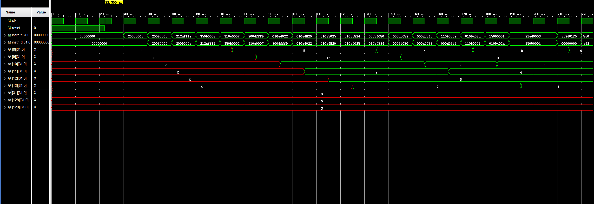
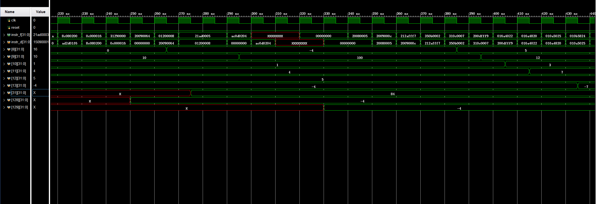
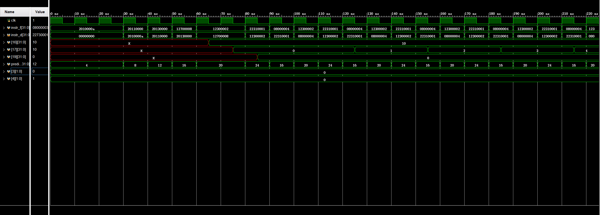

# Pipeline Mips CPU

32 位流水线 MIPS 指令集 CPU, 利用 systemverilog 编写

## 1. 实验原理

### 1.1 流水线分段

- IF 段: 取指令段. 从 ROM 中读取指令, 并在下一个时钟沿到来前把指令送到 ID 段的指令缓冲器中
- ID 段: 指令译码器. 对 IF 段来的指令进行译码, 并产生相应的控制信号. 整个 CPU 的控制信号基本都是在这段上产生. 该段自身不需任何控制信号. 流水线冲突检测也在该段进行, 在检测到冲突条件成立时, 冲突检测电路产生 `stall` 信号清空 ID/EX 寄存器, 在流水线中插入一个气泡
- EX 段: 执行段. 该段进行算数或逻辑操作, 此外 `lw`, `sw` 指令所用的 RAM 访问地址也是在本段上实现
- MEM 段: 储访问段. 只有在执行 `lw`, `sw` 指令时才对存储器进行读写, 对其他指令没有任何副作用
- WB 段: 写回段. 该段把指令执行的结果写到寄存器文件中

### 1.2 流水线冲突

1. 数据冲突: 在一个操作必须等待另一操作完成后才能进行时, 流水线必须停顿
2. 控制冲突: CPU 需要根据分支指令的结果做出决策, 而此时其他指令可能还在执行中, 这时会出现控制冲突

### 1.3 控制信号

控制信号表和单周期的基本相同, 区别在于流水线同一周期会有多条指令执行, 所以信号要按周期区分, 比如 `reg_we` 分为 `reg_we_d`, `reg_we_e` 等

## 2. MIPS 指令集

### 2.1 实现指令集

```text {.line-numbers}
add $rd, $rs, $rt   # [rd] = [rs] + [rt]
sub $rd, $rs, $rt   # [rd] = [rs] - [rt]
and $rd, $rs, $rt   # [rd] = [rs] & [rt]
or $rd, $rs, $rt    # [rd] = [rs] | [rt]
slt $rd, $rs, $rt   # [rd] = [rs] < [rt] ? 1 : 0
sll $rd, $rt, shamt # [rd] = [rt] << shamt
srl $rd, $rt, shamt # [rd] = [rt] >> shamt
sra $rd, $rt, shamt # [rd] = [rt] >>> shamt
addi $rt, $rs, imm  # [rt] = [rs] + SignImm
andi $rt, $rs, imm  # [rt] = [rs] & ZeroImm
ori $rt, $rs, imm   # [rt] = [rs] | ZeroImm
slti $rt, $rs, imm  # [rt] = [rs] < SignImm ? 1 : 0
lw $rt, imm($rs)    # [rt] = [Address]
sw $rt, imm($rs)    # [Address] = [rt]
j label             # PC = JTA
jal label           # [ra] = PC + 4, PC = JTA
jr $rs              # PC = [rs]
beq $rs, $rt, label # if ([rs] == [rt]) PC = BTA
bne $rs, $rt, label # if ([rs] != [rt]) PC = BTA
nop                 # No operation
```

其中使用的符号释义如下：

- `[reg]`：寄存器 `$reg` 中的内容
- `imm`：I 类型指令的 16 位立即数字段
- `addr`：J 类型指令的 26 位地址字段
- `label`：指定指令地址的文本
- `SignImm`：32 位符号扩展的立即数 ( `= {{16{imm[15]}}, imm}` )
- `ZeroImm`：32 位 0 扩展的立即数 ( `= {16'b0, imm}` )
- `Address`：`[rs] + SignImm`
- `[Address]`：存储器单元 `Address` 地址中的内容
- `JTA`：跳转目标地址 ( `= {(PC + 4)[31:28], addr, 2'b0}` )
- `BTA`：分支目标地址 ( `= PC + 4 + (SignImm << 2)` )

### 2.2 对应机器码格式

```
add:    0000 00ss ssst tttt dddd d--- --10 0000
sub:    0000 00ss ssst tttt dddd d--- --10 0010
and:    0000 00ss ssst tttt dddd d--- --10 0100
or:     0000 00ss ssst tttt dddd d--- --10 0101
slt:    0000 00ss ssst tttt dddd d--- --10 1010
sll:    0000 00ss ssst tttt dddd dhhh hh00 0000
srl:    0000 00-- ---t tttt dddd dhhh hh00 0010
sra:    0000 00-- ---t tttt dddd dhhh hh00 0011
addi:   0010 00ss ssst tttt iiii iiii iiii iiii
andi:   0011 00ss ssst tttt iiii iiii iiii iiii
ori:    0011 01ss ssst tttt iiii iiii iiii iiii
slti:   0010 10ss ssst tttt iiii iiii iiii iiii
lw:     1000 11ss ssst tttt iiii iiii iiii iiii
sw:     1010 11ss ssst tttt iiii iiii iiii iiii
j:      0000 10aa aaaa aaaa aaaa aaaa aaaa aaaa
jal:    0000 11aa aaaa aaaa aaaa aaaa aaaa aaaa
jr:     0000 00ss sss- ---- ---- ---- --00 1000
beq:    0001 00ss ssst tttt iiii iiii iiii iiii
bne:    0001 01ss ssst tttt iiii iiii iiii iiii
nop:    0000 0000 0000 0000 0000 0000 0000 0000
```

### 2.3 译码表

#### 主译码器真值表

| 指令 | **opcode** | **funct** | `jump` | `reg_we` | `sel_reg_write_addr` | `sel_reg_write_data` | `mem_we` | `sel_alu_src_a` | `sel_alu_src_b` | `alu_op` | `branch` | `sel_jal` |
| :--- | :--------: | :-------- | ------ | :------: | :--------------: | :--------------: | :------: | :---------: | :---------: | :------: | :------: | :----------: |
| `addi` | 6'b00_1000 | 6'bXX_XXXX | 00 | 1 | 0 | 0 | 0 | 0 | 01 | 000 | 00 | 0 |
| `andi` | 6'b00_1100 | 6'bXX_XXXX | 00 | 1 | 0 | 0 | 0 | 0 | 01 | 010 | 00 | 0 |
|  `ori` | 6'b00_1101 | 6'bXX_XXXX | 00 | 1 | 0 | 0 | 0 | 0 | 01 | 011 | 00 | 0 |
|  `lw`  | 6'b10_0011 | 6'bXX_XXXX | 00 | 1 | 0 | 1 | 0 | 0 | 01 | 000 | 00 | 0 |
|  `sw`  | 6'b10_1011 | 6'bXX_XXXX | 00 | 0 | 0 | 0 | 1 | 0 | 01 | 000 | 00 | 0 |
|  `j`   | 6'b00_0010 | 6'bXX_XXXX | 01 | 0 | 0 | 0 | 0 | 0 | 00 | 000 | 00 | 0 |
|  `jr`  | 6'b00_0000 | 6'b00_1000 | 10 | 0 | 0 | 0 | 0 | 0 | 00 | 000 | 00 | 0 |
|  `jal` | 6'b00_0011 | 6'bXX_XXXX | 01 | 1 | 0 | 0 | 0 | 0 | 00 | 000 | 00 | 1 |
|  `beq` | 6'b00_0100 | 6'bXX_XXXX | 00 | 0 | 0 | 0 | 0 | 0 | 00 | 000 | 01 | 0 |
|  `bne` | 6'b00_0101 | 6'bXX_XXXX | 00 | 0 | 0 | 0 | 0 | 0 | 00 | 000 | 10 | 0 |
|  `sll` | 6'b00_0000 | 6'b00_0000 | 00 | 1 | 1 | 0 | 0 | 1 | 10 | 100 | 00 | 0 |
|  `srl` | 6'b00_0000 | 6'b00_0010 | 00 | 1 | 1 | 0 | 0 | 1 | 10 | 101 | 00 | 0 |
|  `sra` | 6'b00_0000 | 6'b00_0011 | 00 | 1 | 1 | 0 | 0 | 1 | 10 | 110 | 00 | 0 |
| R-Type | 6'b00_0000 | 6'bXX_XXXX | 00 | 1 | 1 | 0 | 0 | 0 | 00 | 111 | 00 | 0 |

说明:

1. `jump`
   - `00`: 非 *jump* 类型指令
   - `01`: `j`, `jal`
   - `10`: `jr`
2. `branch`: 至于大于小于跳转什么的, 就是单纯的增加 `branch` 的位数, 因此不写了
   - `01`: `beq`
   - `10`: `bne`
3. `sel_alu_src_a`
   - `0`: `rs`
   - `1`: `rt`, 为了支持位移操作
4. `sel_alu_src_b`
   - `00`: `rt`
   - `01`: `imm`
   - `10`: `shmt`

#### ALU 真值表

| alu_op | alu_control | operation |
| :----: | :---------: | :-------: |
| 000 | 010 | add |
| 001 | 110 | sub |
| 010 | 000 | and |
| 011 | 001 | or  |
| 100 | 011 | sll |
| 101 | 100 | srl |
| 110 | 101 | sra |
| 111 | XXX | func|

## 3. 部件构成及实现代码


如图所示为流水线 MIPS CPU 的整体概览, 与单周期 MIPS CPU 是一样的, 区别在于 CPU 核心 mips 的实现. 以下将仅介绍与单周期不同的部分, 其余请参见单周期实验报告

### 3.1 `mips`

本流水线 CPU 的实现中, 将 datapath 按照流水线的 5 个阶段划分为了 5 个模块 (Fetch, Decode, Execute, Memory, Writeback), 以及将流水线 并增加了一个用于处理冲突的冲突单元 (Hazard Unit), 其中各模块的作用如下：

- Fetch: 取指令阶段, 从指令存储器中读取指令
- Decode: 译码阶段, 从寄存器文件中读取源操作数, 并对指令译码以产生控制信号
- Execute: 执行阶段, 使用 ALU 执行计算
- Memory: 存储器阶段, 读写数据存储器
- Writeback: 写回阶段, 按需将结果写回到寄存器文件
- Control Unit: 处理控制信号
- Hazard Unit: 冲突单元, 用于发现及处理数据冲突和控制冲突

方便起见, 将 Fetch 阶段和 Decode 阶段之间的流水线寄存器命名为 `decode_reg`, 其余流水线寄存器同理.

具体模块功能分析将在下文阐述. 这里 `mips` 的作用就是将这些模块连接起来, 其中相同名称的端口即连通. 除此以外特殊的几条连线如下所示:

- `mips` 读端口 `instr`, `mem_read_data` 分别与 `instr_f`, `mem_read_data_m` 连通
- `mips` 写端口 `pc`, `mem_we`, `mem_data_addr`, `mem_write_data` 分别与 `pc_f`, `mem_we_m`, `alu_result_m`, `mem_write_data_m` 连通

了解了以上连接规则后, 展示 mips 的完整总览图就不那么必要. 比起大而繁乱的连线总览图, 直接看代码甚至都更为直观

```verilog
module mips (
    input   logic   clk,
    input   logic   rst,
    input   logic   [31:0]instr,
    input   logic   [31:0]mem_read_data,

    output  logic   [31:0]pc,
    output  logic   mem_we,
    output  logic   [31:0]mem_data_addr,
    output  logic   [31:0]mem_write_data
);
    logic stall_f, stall_d, flush_d, forward_a_d, forward_b_d, flush_e;
    logic [1:0]forward_a_e, forward_b_e;

    logic pc_src_d, equal, reg_we_e, sel_reg_write_data_e,
        reg_we_m, sel_reg_write_data_m, reg_we_w;
    logic [1:0]jump, branch, control_m_o, control_w;
    logic [2:0]control_e_o, control_m;
    logic [10:0]control_d, control_e;

    logic [4:0]rs_d, rt_d, rd_d, rs_e, rt_e, rd_e,
        reg_write_addr_e, reg_write_addr_m, reg_write_addr_w;
    logic [31:0]instr_f, pc_f, pc_next_f, pc_plus_4_f;
    logic [31:0]instr_d, pc_branch_d, reg_src_a_d, pc_plus_4_d, reg_data_1_d, 
        reg_data_2_d, imm_d, shamt_d;
    logic [31:0]reg_data_1_e, reg_data_2_e, imm_e, shamt_e, pc_plus_4_e,
        alu_result_e, mem_write_data_e;
    logic [31:0]alu_result_m, mem_write_data_m, mem_read_data_m;
    logic [31:0]mem_read_data_w, reg_write_data_w, alu_result_w;

    assign pc = pc_f;
    assign instr_f = instr;

    assign mem_data_addr = alu_result_m;
    assign mem_write_data = mem_write_data_m;
    assign mem_read_data_m = mem_read_data;


    fetch_reg fetchReg(
        .clk,
        .rst,
        .stall_f(stall_f),
        .pc_next_f(pc_next_f),
        .pc_f(pc_f)
    );
    fetch fetch(
        .instr_d(instr_d),
        .pc_f(pc_f),
        .pc_branch_d(pc_branch_d),
        .reg_src_a_d(reg_src_a_d),
        .pc_src_d(pc_src_d),
        .jump(jump),
        .pc_next_f(pc_next_f),
        .pc_plus_4_f(pc_plus_4_f)
    );
    decode_reg decodeReg(
        .clk,
        .rst,
        .stall_d(stall_d),
        .flush_d(flush_d),
        .instr_f(instr_f),
        .pc_plus_4_f(pc_plus_4_f),
        .instr_d(instr_d),
        .pc_plus_4_d(pc_plus_4_d)
    );

    // control logic
    control_unit controlUnit(
        .operation(instr_d[31:26]),
        .func(instr_d[5:0]),
        .equal(equal),
        .pc_src(pc_src_d),
        .jump(jump),
        .branch(branch),
        .control(control_d)
    );

    decode decode(
        .clk,
        .instr_d(instr_d),
        .pc_plus_4_d(pc_plus_4_d),
        .reg_we_w(reg_we_w),
        .alu_result_m(alu_result_m),
        .reg_write_addr_w(reg_write_addr_w),
        .reg_write_data_w(reg_write_data_w),
        .forward_a_d(forward_a_d),
        .forward_b_d(forward_b_d),
        .reg_data_1_d(reg_data_1_d),
        .reg_data_2_d(reg_data_2_d),
        .rs_d(rs_d),
        .rt_d(rt_d),
        .rd_d(rd_d),
        .imm_d(imm_d),
        .shamt_d(shamt_d),
        .pc_branch_d(pc_branch_d),
        .reg_src_a_d(reg_src_a_d),
        .equal_d(equal)
    );
    execute_reg executeReg(
        .clk,
        .rst,
        .flush_e(flush_e),
        .control_d(control_d),
        .reg_data_1_d(reg_data_1_d),
        .reg_data_2_d(reg_data_2_d),
        .rs_d(rs_d),
        .rt_d(rt_d),
        .rd_d(rd_d),
        .imm_d(imm_d),
        .shamt_d(shamt_d),
        .pc_plus_4_d(pc_plus_4_d),
        .control_e(control_e),
        .reg_data_1_e(reg_data_1_e),
        .reg_data_2_e(reg_data_2_e),
        .rs_e(rs_e),
        .rt_e(rt_e),
        .rd_e(rd_e),
        .imm_e(imm_e),
        .shamt_e(shamt_e),
        .pc_plus_4_e(pc_plus_4_e)
    );
    execute execute(
        .control_e_i(control_e),
        .reg_data_1_e(reg_data_1_e),
        .reg_data_2_e(reg_data_2_e),
        .rt_e(rt_e),
        .rd_e(rd_e),
        .imm_e(imm_e),
        .shamt_e(shamt_e),
        .pc_plus_4_e(pc_plus_4_e),
        .reg_write_data_w(reg_write_data_w),
        .alu_result_m(alu_result_m),
        .forward_a_e(forward_a_e),
        .forward_b_e(forward_b_e),
        .reg_we_e(reg_we_e),
        .sel_reg_write_data_e(sel_reg_write_data_e),
        .control_e_o(control_e_o),
        .alu_result_e(alu_result_e),
        .mem_write_data_e(mem_write_data_e),
        .reg_write_addr_e(reg_write_addr_e)
    );
    memory_reg memoryReg(
        .clk,
        .rst,
        .control_e(control_e_o),
        .alu_result_e(alu_result_e),
        .mem_write_data_e(mem_write_data_e),
        .reg_write_addr_e(reg_write_addr_e),
        .control_m(control_m),
        .alu_result_m(alu_result_m),
        .mem_write_data_m(mem_write_data_m),
        .reg_write_addr_m(reg_write_addr_m)
    );
    memory memory(
        .control_m_i(control_m),
        .sel_reg_write_data_m(sel_reg_write_data_m),
        .reg_we_m(reg_we_m),
        .mem_we_m(mem_we),
        .control_m_o(control_m_o)
    );
    writeback_reg writebackReg(
        .clk,
        .rst,
        .control_m(control_m_o),
        .mem_read_data_m(mem_read_data_m),
        .alu_result_m(alu_result_m),
        .reg_write_addr_m(reg_write_addr_m),
        .control_w(control_w),
        .mem_read_data_w(mem_read_data_w),
        .alu_result_w(alu_result_w),
        .reg_write_addr_w(reg_write_addr_w)
    );
    writeback writeback(
        .control_w(control_w),
        .mem_read_data_w(mem_read_data_w),
        .alu_result_w(alu_result_w),
        .reg_we_w(reg_we_w),
        .reg_write_data_w(reg_write_data_w)
    );

    hazard_unit hazardUnit(
        .rs_d(rs_d),
        .rt_d(rt_d),
        .branch_d(branch),
        .pc_src_d(pc_src_d),
        .jump_d(jump),
        .rs_e(rs_e),
        .rt_e(rt_e),
        .reg_write_addr_e(reg_write_addr_e),
        .sel_reg_write_data_e(sel_reg_write_data_e),
        .reg_we_e(reg_we_e),
        .reg_write_addr_m(reg_write_addr_m),
        .sel_reg_write_data_m(sel_reg_write_data_m),
        .reg_we_m(reg_we_m),
        .reg_write_addr_w(reg_write_addr_w),
        .reg_we_w(reg_we_w),
        .stall_f(stall_f),
        .stall_d(stall_d),
        .flush_d(flush_d),
        .forward_a_d(forward_a_d),
        .forward_b_d(forward_b_d),
        .flush_e(flush_e),
        .forward_a_e(forward_a_e),
        .forward_b_e(forward_b_e)
    );
endmodule: mips
```

### 3.2 Fetch

#### 3.2.1 `fetch_reg`

Fetch 阶段流水线寄存器. 结构很简单, 就是将 PC 寄存器 `pc_reg` 封装了一下. 但相较于多周期版本的 `flip_flop`, 流水线版本做了一些调整

在需要解决冲突的情况下, 通过 `stall_f` 信号决定是否保持 ( stall ) 或清空 ( flush ) 对应流水线寄存器保存的数据, 其中 `stall_f` 为 `1` 时保持当前 PC 值不更新. 具体这些信号在何时为何值, 将在 `hazard_unit` 章节详细阐述, 下同

```verilog
module fetch_reg (
    input   logic   clk, rst,
    input   logic   stall_f,
    input   logic   [31:0]pc_next_f,
    output  logic   [31:0]pc_f
);
    flip_flop pcReg (
        .clk(clk),
        .rst(rst),
        .we(~stall_f),
        .clr(0),
        .in(pc_next_f),
        .out(pc_f)
    );

endmodule: fetch_reg
```

#### 3.2.2 `fetch`

Fetch 阶段, 通过 `pc_f` 输出指令地址 `pc` 到 `instr_mem`, 通过 `instr_f` 从 `instr_mem` 读入指令 `instr`, 存储到流水线寄存器 `decode_reg` 中, 在下一个时钟上升沿到达时从 `instr_d` 输出.

此外, 本阶段还需要完成 PC 的更新. `pc_next_f` ( 新的 PC 值 ) 的选择逻辑同单周期实验报告内容相同，这里就不再赘述了. 需要注意的是 Fetch 阶段需要用到一些 Decode 阶段的数据, 也就是上一条指令计算得到的相对寻址地址 `pc_branch_d`, 用于指令 `jr` 跳转的地址 `reg_src_a_d`, 指令解析得到的 `pc_src_d`, `jump` 信号, 用来确定 `pc_next_f` 的值

```verilog
module fetch (
    input   logic   [31:0]instr_d,
    input   logic   [31:0]pc_f,
    input   logic   [31:0]pc_branch_d,
    input   logic   [31:0]reg_src_a_d,
    input   logic   pc_src_d,
    input   logic   [1:0]jump,

    output  logic   [31:0]pc_next_f,
    output  logic   [31:0]pc_plus_4_f
);
    logic [31:0]pc_branch_next;

    adder pcAdd4(
        .a(pc_f),
        .b(4),
        .result(pc_plus_4_f)
    );
    mux2 pcBranchNext(
        .selector(pc_src_d),
        .s0(pc_plus_4_f),
        .s1(pc_branch_d),
        .result(pc_branch_next)
    );

    mux4 pcNext(
        .selector(jump),
        .s0(pc_branch_next), // beq, bne & normal instructor
        .s1({pc_f[31:28], instr_d[25:0], 2'b00}), // jal, j
        .s2(reg_src_a_d),  // jr
        .s3(),
        .result(pc_next_f)
    );

endmodule: fetch
```

##### `flip_flop`

这里只说与多周期版本的区别

首先增加了一个清零信号 `clr`, 当 `clr` 为 `1` 时，将保存的数据同步清零 ( rst 为异步清零 ), 用于 `flush` 信号. 尽管这里 `fetch_reg` 并不需要用到, 但其他流水线寄存器可能会需要, 这里是出于部件复用的考虑. 其次增加了一个**低电平**有效的保持信号 `we`, 当 `we` 为 `0` 时, 保持数据不变. 对于 `fetch_reg` 来说, 其值即 `~stall_f`

```verilog
// flip flop
module flip_flop #(
parameter WIDTH = 32
)(
    input   logic   clk, rst,
    input   logic   we,
    input   logic   clr,
    input   logic   [WIDTH - 1:0]in,
    output  logic   [WIDTH - 1:0]out
);
    always_ff @(posedge clk or posedge rst) begin
        if(rst || clr)
            out <= 0;
        else if(we)
            out <= in;
    end
endmodule: flip_flop
```

### 3.3 Decode

#### 3.3.1 `decode_reg`

Fetch 阶段和 Decode 阶段之间的流水线寄存器. 中转一下 `instr` 和 `pc_plus_4`. 为什么需要用触发器中转数据? 因为流水线上需要同时跑多条指令 ( 这里是 5 条), 需要控制每个阶段各自只在执行一条指令

在需要解决冲突的情况下, 通过 `stall_d`, `flush_d` 信号决定是否保持 ( stall ) 或清空 ( flush ) 对应流水线寄存器保存的数据, 其中 `stall_d` 为 `1` 时保持当前 `decode_reg` 的数据不更新, `flush_d` 为 `1` 时清空 `decode_reg` 的数据.

这里 `instr_reg` 的 `clr` 信号为 `~stall_d & flush_d`, 是为了使 `stall_d` 和 `flush_d` 信号互斥, 且强制 `stall_d` 的优先级更高 ( 当 `stall_d` 为 `1` 时，`flush_d` 无效，不允许清零 ), 否则当两者同时为 `1` 时会导致错误 ( 因为在触发器的实现中, `flush` 的优先级更高, 这将导致指令丢失). `pc_plus_4_reg` 不需要清零, 因此 `clr` 信号恒为 `0`

```verilog
module decode_reg (
    input   logic   clk, rst,
    input   logic   stall_d,
    input   logic   flush_d,
    input   logic   [31:0]instr_f,
    input   logic   [31:0]pc_plus_4_f,

    output  logic   [31:0]instr_d,
    output  logic   [31:0]pc_plus_4_d
);
    flip_flop instrReg(
        .clk(clk),
        .rst(rst),
        .we(~stall_d),
        .clr(~stall_d & flush_d),
        .in(instr_f),
        .out(instr_d)
    );
    flip_flop pcPlus4Reg(
        .clk(clk),
        .rst(rst),
        .we(~stall_d),
        .clr(0),
        .in(pc_plus_4_f),
        .out(pc_plus_4_d)
    );
endmodule: decode_reg
```

#### 3.3.2 `decode`

Decode 阶段, 读入指令 `instr_d`, 由控制单元 control_unit 解析, 决定各个控制信号. 此外, 本阶段还需要完成相对寻址地址 `pc_branch_d` 的计算, 然后交给下一条指令的 Fetch 阶段

作为**静态分支预测**, 本阶段新增了比较器 `equal_cmp`, 用来比较从寄存器中读出的两个数 `reg_src_a_d`, `reg_src_b_d` 是否相等, 其作用是将指令 `beq`, `bne` 的比较过程提前到 Decode 阶段, 提前得到 `pc_src_d` 信号, 从而提高效率. 这里需要用到 Memory 阶段的数据 `alu_result_m` 以应对数据冒险, `reg_data_1_d`, `reg_data_2_d` 取值的选择由 `forward_a_d`, `forward_b_d` 信号控制

在实现中, 将寄存器文件 reg_file 放在了 decode 模块里, 因此 Writeback 阶段的寄存器写入操作也将在这里完成. 所以这里需要用到一些 Writeback 阶段的数据, 也就是 `reg_we_w` 信号, 目标寄存器 `reg_write_addr_w`, 写入数据 `reg_write_data_w`

```verilog
module decode (
    input   logic   clk,

    input   logic   [31:0]instr_d,
    input   logic   [31:0]pc_plus_4_d,

    input   logic   reg_we_w,
    input   logic   [31:0]alu_result_m,
    input   logic   [4:0]reg_write_addr_w,
    input   logic   [31:0]reg_write_data_w,

    input   logic   forward_a_d,
    input   logic   forward_b_d,

    output  logic   [31:0]reg_data_1_d,
    output  logic   [31:0]reg_data_2_d,
    output  logic   [4:0]rs_d,
    output  logic   [4:0]rt_d,
    output  logic   [4:0]rd_d,
    output  logic   [31:0]imm_d,
    output  logic   [31:0]shamt_d,

    output  logic   [31:0]pc_branch_d,
    output  logic   [31:0]reg_src_a_d,
    output  logic   equal_d
);
    logic [31:0]reg_src_b_d;

    assign rs_d = instr_d[25:21];
    assign rt_d = instr_d[20:16];
    assign rd_d = instr_d[15:11];

    register_file reg_file(
        .clk(clk),
        .we(reg_we_w),
        .r_addr_1(instr_d[25:21]),
        .r_addr_2(instr_d[20:16]),
        .w_addr(reg_write_addr_w),
        .write_data(reg_write_data_w),
        .rd_data_1(reg_data_1_d),
        .rd_data_2(reg_data_2_d)
    );
    mux2 srcAMux2(
        .selector(forward_a_d),
        .s0(reg_data_1_d),
        .s1(alu_result_m),
        .result(reg_src_a_d)
    );
    mux2 srcBMux2(
        .selector(forward_b_d),
        .s0(reg_data_2_d),
        .s1(alu_result_m),
        .result(reg_src_b_d)
    );
    equal_cmp equalCmp(
        .in_1(reg_src_a_d),
        .in_2(reg_src_b_d),
        .out(equal_d)
    );

    sign_extension immExtension(
        .in(instr_d[15:0]),
        .out(imm_d)
    );
    adder getPcBranch(
        .a(pc_plus_4_d),
        .b({imm_d[29:0], 2'b00}),
        .result(pc_branch_d)
    );

    unsign_extension shamtExtension(
        .in(instr_d[10:6]),
        .out(shamt_d)
    );
endmodule: decode

```

##### `equal_cmp`

32 位比较器, 用于比较两个数是否相等

使用时读入 `in_1` 和 `in_2`, 若 `in_1` 和 `in_2` 相等则从 `out` 输出 `1`

```verilog
// equality comparator
module equal_cmp #(
    parameter Width = 32
)(
    input   logic   [31:0]in_1, in_2,
    output  logic   out
);
    assign out = in_1 == in_2? 1: 0;
endmodule: equal_cmp
```

##### `sign_extension` & `unsign_extension`

```verilog
// signal extension
module sign_extension #(
    parameter Width = 16
)(
    input   logic   [Width-1:0]in,
    output  logic   [31:0]out
);
    assign out = {{(32-Width){in[Width-1]}}, in};
endmodule: sign_extension

// unsignal extension
module unsign_extension #(
    parameter Width = 5
)(
    input   logic   [Width-1:0]in,
    output  logic   [31:0]out
);
    assign out = {{(32-Width){1'b0}}, in};
endmodule: unsign_extension

```

##### `register_file`

流水线版本中, 寄存器文件调整为在时钟**下降沿**将数据写入, 其余同单周期版本

```verilog
module register_file (
    input   logic   clk, we,
    input   logic   [4:0]r_addr_1,
    input   logic   [4:0]r_addr_2,
    input   logic   [4:0]w_addr,
    input   logic   [31:0]write_data,
    output  logic   [31:0]rd_data_1,
    output  logic   [31:0]rd_data_2
);
    logic [31:0] RegFile[31:0];

    always_ff @(negedge clk) begin
        if(we)
            RegFile[w_addr] <= write_data;
    end

    assign rd_data_1 = r_addr_1? RegFile[r_addr_1]: 0;
    assign rd_data_2 = r_addr_2? RegFile[r_addr_2]: 0;

endmodule: register_file
```

#### 3.3.3 `control_unit`

相对于多周期没有太多变化

```verilog
module control_unit (
    input   logic   [5:0]operation,
    input   logic   [5:0]func,
    input   logic   equal,

    output  logic   pc_src,
    output  logic   [1:0]jump,
    output  logic   [1:0]branch,
    // output  logic   sel_jal,
    output  logic   [10:0]control
);
    logic [2:0]alu_op, alu_control;
    logic [1:0]sel_alu_src_b;
    logic reg_we, sel_reg_write_data, mem_we, sel_alu_src_a, sel_reg_write_addr, sel_jal;

    main_decoder main_decoder(
        .operation(operation),
        .func(func),
        .jump(jump),
        .reg_we(reg_we),
        .sel_reg_write_addr(sel_reg_write_addr),
        .sel_reg_write_data(sel_reg_write_data),
        .mem_we(mem_we),
        .sel_alu_src_a(sel_alu_src_a),
        .sel_alu_src_b(sel_alu_src_b),
        .alu_op(alu_op),
        .branch(branch),
        .sel_jal(sel_jal)
    );

    alu_decoder alu_decoder(
        .func(func),
        .alu_op(alu_op),
        .alu_control(alu_control)
    );
    assign pc_src = (branch[1] & !equal) | (branch[0] & equal);
    assign control = {reg_we, sel_reg_write_data, mem_we, alu_control, sel_alu_src_a,
        sel_alu_src_b, sel_reg_write_addr, sel_jal};
endmodule: control_unit


module main_decoder (
    input   logic   [5:0]operation,
    input   logic   [5:0]func,
    output  logic   [1:0]jump,
    output  logic   reg_we,
    output  logic   sel_reg_write_addr,
    output  logic   sel_reg_write_data,
    output  logic   mem_we,
    output  logic   sel_alu_src_a,
    output  logic   [1:0]sel_alu_src_b,
    output  logic   [2:0]alu_op,
    output  logic   [1:0]branch,
    output  logic   sel_jal
);
    logic [14:0]controls;
    assign {jump, reg_we, sel_reg_write_addr, sel_reg_write_data, mem_we, sel_alu_src_a,
        sel_alu_src_b, alu_op, branch, sel_jal} = controls;
    always_comb begin
        case(operation)
            6'b00_0000: begin
                case (func)
                    6'b00_0000: controls = 15'b00_1_1_0_0_1_10_100_00_0; // sll
                    6'b00_0010: controls = 15'b00_1_1_0_0_1_10_101_00_0; // srl
                    6'b00_0011: controls = 15'b00_1_1_0_0_1_10_110_00_0; // sra
                    6'b00_1000: controls = 15'b10_0_0_0_0_0_00_000_00_0; // jr
                    default:    controls = 15'b00_1_1_0_0_0_00_111_00_0; // R-Type
                endcase
            end
            6'b10_0011: controls = 15'b00_1_0_1_0_0_01_000_00_0; // lw
            6'b10_1011: controls = 15'b00_0_0_0_1_0_01_000_00_0; // sw
            6'b00_0100: controls = 15'b00_0_0_0_0_0_00_000_01_0; // beq
            6'b00_0101: controls = 15'b00_0_0_0_0_0_00_000_10_0; // bne
            6'b00_1000: controls = 15'b00_1_0_0_0_0_01_000_00_0; // addi
            6'b00_1100: controls = 15'b00_1_0_0_0_0_01_010_00_0; // andi
            6'b00_1101: controls = 15'b00_1_0_0_0_0_01_011_00_0; // ori
            6'b00_0010: controls = 15'b01_0_0_0_0_0_00_000_00_0; // j
            6'b00_0011: controls = 15'b01_1_0_0_0_0_00_000_00_1; // jal
            default:    controls = 15'bXXX_XXXX_XXXX_XXXX; // illegal op
        endcase
    end
endmodule: main_decoder


module alu_decoder (
    input   logic   [5:0]func,
    input   logic   [2:0]alu_op,
    output  logic   [2:0]alu_control
);
    always_comb begin
        case(alu_op)
            3'b000: alu_control = 3'b010; // add
            3'b001: alu_control = 3'b110; // sub
            3'b010: alu_control = 3'b000; // and
            3'b011: alu_control = 3'b001; // or
            3'b100: alu_control = 3'b011; // sll
            3'b101: alu_control = 3'b100; // srl
            3'b110: alu_control = 3'b101; // sra
            default: case(func)
                6'b10_0100: alu_control = 3'b000; // and
                6'b10_0101: alu_control = 3'b001; // or
                6'b10_0000: alu_control = 3'b010; // add
                6'b00_0100: alu_control = 3'b011; // sllv
                6'b00_0110: alu_control = 3'b100; // srlv
                6'b00_0111: alu_control = 3'b101; // srav
                6'b10_0010: alu_control = 3'b110; // sub
                6'b10_1010: alu_control = 3'b111; // slt
                default:    alu_control = 3'bXXX; // illegal funct
            endcase
        endcase
    end
endmodule: alu_decoder
```

### 3.4 Execute

#### 3.4.1 `execute_reg`

Decode 阶段和 Execute 阶段之间的流水线寄存器, 中转一下 `control`, `pc_plus_4`, `reg_data_1`, `reg_data_2`, `rs`, `rt`, `rd`, `shamt`, `ext_imm`, 其中:
- `control` 是控制信号 `reg_we`, `sel_reg_write_data`, `mem_we`, `alu_control`, `sel_alu_src_a`, `sel_alu_src_b`, `sel_reg_write_addr`, `sel_jal` 的集合, 这样代码写起来方便一点
- `pc_plus_4` 是 `PC + 4` 的值; 由于指令 jal 在之后还需要用到这个值, 因此需要继续传到 Execute 阶段
- `reg_data_1`, `reg_data_2` 是 reg_file 读出的两个值
- `rs`, `rt`, `rd` 分别是 `instr_d[25:21]`, `instr_d[20:16]`, `instr_d[15:11]`
- `ext_imm` 是 32 位扩展后的 `instr_d[15:0]`
- `shamt` 是 32 位扩展后的 `instr_d[10:6]`

在需要解决冲突的情况下, 通过 `stall_e`, `flush_e` 信号决定是否保持或清空 execute_reg 保存的数据

结构及原理同 decode_reg，不再赘述，下同

```verilog
module execute_reg (
    input   logic   clk, rst,
    input   logic   flush_e,

    input   logic   [10:0]control_d,
    input   logic   [31:0]reg_data_1_d,
    input   logic   [31:0]reg_data_2_d,
    input   logic   [4:0]rs_d,
    input   logic   [4:0]rt_d,
    input   logic   [4:0]rd_d,
    input   logic   [31:0]imm_d,
    input   logic   [31:0]shamt_d,
    input   logic   [31:0]pc_plus_4_d,

    output  logic   [10:0]control_e,
    output  logic   [31:0]reg_data_1_e,
    output  logic   [31:0]reg_data_2_e,
    output  logic   [4:0]rs_e,
    output  logic   [4:0]rt_e,
    output  logic   [4:0]rd_e,
    output  logic   [31:0]imm_e,
    output  logic   [31:0]shamt_e,
    output  logic   [31:0]pc_plus_4_e
);
    flip_flop#(11) controlReg(
        .clk(clk),
        .rst(rst),
        .we(1),
        .clr(flush_e),
        .in(control_d),
        .out(control_e)
    );

    flip_flop regData1Reg(
        .clk(clk),
        .rst(rst),
        .we(1),
        .clr(flush_e),
        .in(reg_data_1_d),
        .out(reg_data_1_e)
    );
    flip_flop regData2Reg(
        .clk(clk),
        .rst(rst),
        .we(1),
        .clr(flush_e),
        .in(reg_data_2_d),
        .out(reg_data_2_e)
    );

    flip_flop#(5) rsReg(
        .clk(clk),
        .rst(rst),
        .we(1),
        .clr(flush_e),
        .in(rs_d),
        .out(rs_e)
    );
    flip_flop#(5) rtReg(
        .clk(clk),
        .rst(rst),
        .we(1),
        .clr(flush_e),
        .in(rt_d),
        .out(rt_e)
    );
    flip_flop#(5) rdReg(
        .clk(clk),
        .rst(rst),
        .we(1),
        .clr(flush_e),
        .in(rd_d),
        .out(rd_e)
    );

    flip_flop immReg(
        .clk(clk),
        .rst(rst),
        .we(1),
        .clr(flush_e),
        .in(imm_d),
        .out(imm_e)
    );
    flip_flop shamtReg(
        .clk(clk),
        .rst(rst),
        .we(1),
        .clr(flush_e),
        .in(shamt_d),
        .out(shamt_e)
    );
    flip_flop pcPlus4Reg(
        .clk(clk),
        .rst(rst),
        .we(1),
        .clr(flush_e),
        .in(pc_plus_4_d),
        .out(pc_plus_4_e)
    );

endmodule: execute_reg
```

#### 3.4.2 `execute`

Execute 阶段, 对操作数 `alu_src_a`, `alu_src_a` 使用 ALU 执行计算. 在单周期版本的基础上, 新增了两个 mux4 用于转发逻辑. 这里需要用到 Memory 阶段的数据 `alu_result_m` 和 Writeback 阶段的数据 `reg_write_data_w` 以应对数据冒险，`read_data_1`, `read_data_2`（分别为通常情况下的 `src_a`, `src_b`）取值的选择由 `forward_a_e`, `forward_b_e` 信号控制

```verilog
module execute (
    input   logic   [10:0]control_e_i,
    input   logic   [31:0]reg_data_1_e,
    input   logic   [31:0]reg_data_2_e,
    // input   logic   [4:0]rs_e,
    input   logic   [4:0]rt_e,
    input   logic   [4:0]rd_e,
    input   logic   [31:0]imm_e,
    input   logic   [31:0]shamt_e,
    input   logic   [31:0]pc_plus_4_e,

    input   logic   [31:0]reg_write_data_w,
    input   logic   [31:0]alu_result_m,
    
    input   logic   [1:0]forward_a_e,
    input   logic   [1:0]forward_b_e,
    // input   logic   jal_e,

    output  logic   reg_we_e,
    output  logic   sel_reg_write_data_e,
    output  logic   [2:0]control_e_o,
    output  logic   [31:0]alu_result_e,
    output  logic   [31:0]mem_write_data_e,
    output  logic   [4:0]reg_write_addr_e
);
    logic mem_we_e, sel_alu_src_a_e, sel_reg_write_addr_e, sel_jal_e;
    logic [1:0]sel_alu_src_b_e;
    logic [2:0]alu_control_e;
    logic [31:0]read_data_1, read_data_2, alu_src_a, alu_src_b, alu_result_temp;

    assign {reg_we_e, sel_reg_write_data_e, mem_we_e, alu_control_e, sel_alu_src_a_e,
        sel_alu_src_b_e, sel_reg_write_addr_e, sel_jal_e} = control_e_i;
    assign control_e_o = {reg_we_e, sel_reg_write_data_e, mem_we_e};
    assign mem_write_data_e = read_data_2;

    // ALU logic
    mux4 readData1Mux4(
        .selector(forward_a_e),
        .s0(reg_data_1_e),
        .s1(reg_write_data_w),
        .s2(alu_result_m),
        .s3(),
        .result(read_data_1)
    );
    mux4 readData2Mux4(
        .selector(forward_b_e),
        .s0(reg_data_2_e),
        .s1(reg_write_data_w),
        .s2(alu_result_m),
        .s3(),
        .result(read_data_2)
    );
    mux2 aluSrcAMux2(
        .selector(sel_alu_src_a_e),
        .s0(read_data_1),
        .s1(read_data_2),
        .result(alu_src_a)
    );
    mux4 aluSrcBMux4(
        .selector(sel_alu_src_b_e),
        .s0(read_data_2),
        .s1(imm_e),
        .s2(shamt_e),
        .s3(),
        .result(alu_src_b)
    );
    alu aluResult(
        .a_i(alu_src_a),
        .b_i(alu_src_b),
        .alu_control_i(alu_control_e),
        .result_o(alu_result_temp)
    );

    mux4#(5) regWriteAddr(
        .selector({sel_jal_e, sel_reg_write_addr_e}),
        .s0(rt_e),
        .s1(rd_e),
        .s2(5'b11111),
        .s3(),
        .result(reg_write_addr_e)
    );
    mux2 aluResultE(
        .selector(sel_jal_e),
        .s0(alu_result_temp),
        .s1(pc_plus_4_e),
        .result(alu_result_e)
    );

endmodule: execute
```

### 3.5 Memory

#### 3.5.1 `memory_reg`

Execute 阶段和 Memory 阶段之间的流水线寄存器. 中转一下 `control`, `alu_result`, `mem_write_data`, `reg_write_addr`, 其中:
- `control` 是控制信号 `reg_we`, `sel_reg_write_data`, `mem_we` 的集合
- `alu_result` 通常是 ALU 的计算结果, 可能作为写入 data_mem 的目标地址, 也可能作为之后需要写入 reg_file 的数据, 之后由传给 Memory 阶段的控制信号控制; 对于指令 jal, 则是之前传下来的 `pc_plus_4`, 因为和 `alu_result` 要走的路径一致, 借路继续传到 Memory 阶段
- `mem_write_data` 是需要写入 data_mem 的数据
- `reg_write_addr` 是之后写入 reg_file 的目标寄存器; 对于指令 jal, 则为 `$ra`

```verilog
module memory_reg (
    input   logic   clk, rst,
    
    input   logic   [2:0]control_e,
    input   logic   [31:0]alu_result_e,
    input   logic   [31:0]mem_write_data_e,
    input   logic   [4:0]reg_write_addr_e,

    output  logic   [2:0]control_m,
    output  logic   [31:0]alu_result_m,
    output  logic   [31:0]mem_write_data_m,
    output  logic   [4:0]reg_write_addr_m
);
    flip_flop#(3) controlReg(
        .clk(clk),
        .rst(rst),
        .we(1),
        .clr(0),
        .in(control_e),
        .out(control_m)
    );

    flip_flop aluResultReg(
        .clk(clk),
        .rst(rst),
        .we(1),
        .clr(0),
        .in(alu_result_e),
        .out(alu_result_m)
    );
    flip_flop memWriteDataReg(
        .clk(clk),
        .rst(rst),
        .we(1),
        .clr(0),
        .in(mem_write_data_e),
        .out(mem_write_data_m)
    );
    flip_flop#(5) regWriteAddrReg(
        .clk(clk),
        .rst(rst),
        .we(1),
        .clr(0),
        .in(reg_write_addr_e),
        .out(reg_write_addr_m)
    );

endmodule: memory_reg
```

#### 3.5.2 `memory`

Memory 阶段, 当 `mem_we_m` 为 `1` 时, 在 data_mem 的目标地址 `alu_result_m` 存储需要写入的数据 `mem_write_data_m`. 不过实际上这件事情并不是在 memory 模块内完成的, 因为 data_mem 在 mips 外面. 因此实现中是在 mips 模块通过 `mem_we`, `mem_data_addr`, `mem_write_data` 将 `mem_we_m`, `alu_result_m`, `mem_write_data_m` 直接输出到 data_mem, 在下一个时钟上升沿到达时 ( 即 Memory 阶段 ) 写入 data_mem. mips 模块则是通过 `mem_read_data` 从 data_mem 读入数据 `read_data`

```verilog
module memory (
    input   logic   [2:0]control_m_i,

    output  logic   sel_reg_write_data_m,
    output  logic   reg_we_m,
    output  logic   mem_we_m,
    output  logic   [1:0]control_m_o
);
    assign {reg_we_m, sel_reg_write_data_m, mem_we_m} = control_m_i;
    assign control_m_o = {reg_we_m, sel_reg_write_data_m};

endmodule: memory
```

### 3.6 Writeback

#### 3.6.1 `writeback_reg`

Memory 阶段和 Writeback 阶段之间的流水线寄存器. 中转一下 `control`, `alu_result`, `mem_read_data`, `reg_write_addr`，其中：

- `control` 是控制信号 `reg_we`, `sel_reg_write_data` 的集合
- `mem_read_data` 是可能需要写入 reg_file 的数据

```verilog
module writeback_reg (
    input   logic   clk, rst,
    
    input   logic   [1:0]control_m,
    input   logic   [31:0]mem_read_data_m,
    input   logic   [31:0]alu_result_m,
    input   logic   [4:0]reg_write_addr_m,

    output  logic   [1:0]control_w,
    output  logic   [31:0]mem_read_data_w,
    output  logic   [31:0]alu_result_w,
    output  logic   [4:0]reg_write_addr_w
);
    flip_flop#(2) controlReg(
        .clk(clk),
        .rst(rst),
        .we(1),
        .clr(0),
        .in(control_m),
        .out(control_w)
    );

    flip_flop memReadDataReg(
        .clk(clk),
        .rst(rst),
        .we(1),
        .clr(0),
        .in(mem_read_data_m),
        .out(mem_read_data_w)
    );
    flip_flop aluResultReg(
        .clk(clk),
        .rst(rst),
        .we(1),
        .clr(0),
        .in(alu_result_m),
        .out(alu_result_w)
    );
    flip_flop#(5) regWriteAddrReg(
        .clk(clk),
        .rst(rst),
        .we(1),
        .clr(0),
        .in(reg_write_addr_m),
        .out(reg_write_addr_w)
    );
endmodule: writeback_reg
```

#### 3.6.2 `writeback`

Writeback 阶段, 由 `sel_reg_write_data` 信号控制 regWriteData 选择写入 reg_file 的数据为 `alu_result` 还是 `mem_read_data`

写入逻辑放在了 decode 模块

``` verilog
module writeback (
    input   logic   [1:0]control_w,
    input   logic   [31:0]mem_read_data_w,
    input   logic   [31:0]alu_result_w,

    output  logic   reg_we_w,
    output  logic   [31:0]reg_write_data_w
);
    logic sel_reg_write_data_w;
    assign {reg_we_w, sel_reg_write_data_w} = control_w;

    mux2 regWriteData(
        .selector(sel_reg_write_data_w),
        .s0(alu_result_w),
        .s1(mem_read_data_w),
        .result(reg_write_data_w)
    );
endmodule: writeback
```

### 3.7 `hazard_unit`

冲突单元根据传入的各阶段寄存器和控制信号, 检查是否存在数据冲突或控制冲突, 并输出相应的控制信号 ( forward, stall, flush ) 以处理冲突

```verilog
module hazard_unit (
    input   logic   [4:0]rs_d,
    input   logic   [4:0]rt_d,
    input   logic   [1:0]branch_d,
    input   logic   pc_src_d,
    input   logic   [1:0]jump_d,
    input   logic   [4:0]rs_e,
    input   logic   [4:0]rt_e,
    input   logic   [4:0]reg_write_addr_e,
    input   logic   sel_reg_write_data_e,
    input   logic   reg_we_e,
    input   logic   [4:0]reg_write_addr_m,
    input   logic   sel_reg_write_data_m,
    input   logic   reg_we_m,
    input   logic   [4:0]reg_write_addr_w,
    input   logic   reg_we_w,

    output  logic   stall_f,
    output  logic   stall_d,
    output  logic   flush_d,
    output  logic   forward_a_d,
    output  logic   forward_b_d,
    output  logic   flush_e,
    output  logic   [1:0]forward_a_e,
    output  logic   [1:0]forward_b_e
);
    logic lw_stall, branch_stall;
    // Solves data hazards with forwarding
    always_comb begin
        if (rs_e && rs_e == reg_write_addr_m && reg_we_m) begin
            forward_a_e = 2'b10;
        end
        else if (rs_e && rs_e == reg_write_addr_w && reg_we_w) begin
            forward_a_e = 2'b01;
        end
        else begin
            forward_a_e = 2'b00;
        end

        if (rt_e && rt_e == reg_write_addr_m && reg_we_m) begin
            forward_b_e = 2'b10;
        end
        else if (rt_e && rt_e == reg_write_addr_w && reg_we_w) begin
            forward_b_e = 2'b01;
        end
        else begin
            forward_b_e = 2'b00;
        end
    end

    // Solves control hazards with forwarding
    assign forward_a_d = rs_d && rs_d == reg_write_addr_m && reg_we_m;
    assign forward_b_d = rt_d && rt_d == reg_write_addr_m && reg_we_m;

    // Solves data hazards with stalls
    assign lw_stall = (rs_d == rt_e || rt_d == rt_e) && sel_reg_write_data_e;

    // Solves control hazards with stalls
    assign branch_stall = (branch_d || jump_d[1])
        && (reg_we_e && (rs_d == reg_write_addr_e || rt_d == reg_write_addr_e)
        || sel_reg_write_data_m && (rs_d == reg_write_addr_m || rt_d == reg_write_addr_m));

    assign stall_d = (branch_stall || lw_stall) === 'X ? 1'b0 : (lw_stall || branch_stall);
    assign flush_e = stall_d;
    assign flush_d = pc_src_d || jump_d;
    assign stall_f = stall_d;

endmodule: hazard_unit
```

#### 2.7.1 数据冲突

当一条指令依赖于另一条指令的结果, 而此结果还未写入寄存器文件时, 将发生写后读 ( Read After Write, RAW ) 数据冲突. 解决 RAW 冲突的方法: 如果此时这个结果已经在某个阶段被计算出来, 那么可以使用重定向 ( forwarding ) 将数据转发过来; 否则需要阻塞 ( stall ) 流水线直到结果可用. 需注意, `$0` 寄存器硬连接为 `0`, 因此源寄存器为 `$0` 时不需要进行转发或阻塞. 以下将阐述这两种方法的具体实现.

##### 1.使用重定向解决冲突

当 Execute 阶段的源寄存器 `$rs` 或 `$rt` 与 Memory 阶段或 Writeback 阶段 ( 即前两条指令 ) 的写入目标寄存器 `reg_write_addr` 相同, 且其 `reg_we` 信号为 `1` 时 ( 即需要写入目标寄存器), 重定向对应的 `reg_data_1` 或 `reg_data_2`. 以 `$rs` 的情况为例 ( `$rt` 同理 ), 重定向逻辑如下:

```verilog
if (rs_e && rs_e == reg_write_addr_m && reg_we_m) begin
    forward_a_e = 2'b10;
end
else if (rs_e && rs_e == reg_write_addr_w && reg_we_w) begin
    forward_a_e = 2'b01;
end
else begin
    forward_a_e = 2'b00;
end
```

其中当 `forward_a_e` 为 `10` 时, Memory 阶段转发的数据是 `alu_result_m`; 当 `forward_a_e` 为 `01` 时, Writeback 阶段转发的数据是 `reg_write_data_w`

需注意这里 Memory 阶段的优先级高于 Writeback 阶段, 因为 Memory 阶段的指令后执行, 包含的数据更新

##### 2.使用阻塞解决冲突

对于指令 lw, 因为它有两个周期的延迟, 意味着其他指令至少要到两个周期后才能使用它的结果. 如果指令 lw 后紧接着一个使用其结果的指令, 则使用重定向无法解决这种冲突, 此时需要阻塞流水线. 现实中, 编译器会针对这种情况做一定的优化, 通过调整指令顺序, 在发生数据冲突的两条指令间插入一条无关指令, 从而避免这种冲突

当 Execute 阶段正在执行的指令是 lw ( 此时 `sel_reg_write_data` 信号为 `1` ), 且 Decode 阶段的任一源操作数 `$rs` 或 `$rt` 与 Execute 阶段的目的寄存器 `$rt` 相同, 阻塞 Decode 阶段直到源操作数准备好. 阻塞逻辑如下:

```verilog
assign lw_stall = (rs_d == rt_e || rt_d == rt_e) && sel_reg_write_data_e;

assign flush_e = stall_d;
assign flush_d = pc_src_d || jump_d;
assign stall_f = stall_d;
```

这里阻塞 Decode 阶段的同时也要阻塞 Fetch 阶段, 并且刷新 ( flush ) Execute 阶段, 产生气泡

#### 3.7.2 控制冲突

在取下一条指令时还不能确定指令地址时, 将发生控制冲突, 即处理器不知道应该取哪条指令. 解决控制冲突的方法: 预测下一条指令地址, 如果预测错误则刷新流水线. 目前的实现中使用的是静态分支预测, 事实上动态分支预测可以获得更高的性能

然而, 静态分支预测将导致新的 RAW 冲突, 因此需要再次使用第 3.7.1 节解决数据冲突时的两种方法

##### 1.使用重定向解决冲突

如果指令的结果在 Writeback 阶段, 则它将在前半周期写入寄存器, 而在后半周期进行读操作, 此时不会产生冲突. 如果指令的结果在 Memory 阶段, 则可以将它重定向回 Decode 阶段的 equal_cmp. 类似上文所述, 以 `$rs` 的情况为例 ( `$rt` 同理 ), 重定向逻辑如下:

```verilog
assign forward_a_d = rs_d && rs_d == reg_write_addr_m && reg_we_m;
```

##### 2.使用阻塞解决冲突

如果指令的结果在 Execute 阶段, 或者指令 lw 的结果在 Memory 阶段, 则需要阻塞流水线. 类似上文所述, 阻塞逻辑如下:

```verilog
assign branch_stall = (branch_d || jump_d[1])
    && (reg_we_e && (rs_d == reg_write_addr_e || rt_d == reg_write_addr_e)
    || sel_reg_write_data_m && (rs_d == reg_write_addr_m || rt_d == reg_write_addr_m));

assign stall_d = (branch_stall || lw_stall) === 'X ? 1'b0 : (lw_stall || branch_stall);
assign flush_e = stall_d;
assign stall_f = stall_d;
```

其中, `jump_d[1]` 信号为 `1` 时表示当前指令为 jr

##### 3.清除无效数据

当发生跳转时, 需要清除跳转指令之后多读的一条无效指令, 即刷新 Decode 阶段, 产生气泡. 刷新逻辑如下:

```verilog
assign flush_d = pc_src_d || jump_d;
```

## 4 动态分支预测

这里简单实现了个 2 位的 local predictor (其实不是很正规...)

### 4.1 结构

#### 1. Branch Prediction Buffer

Branch Prediction Buffer 也就是这个动态分支预测器的主体, 负责预测跳转地址并与 CPU 交互

实现中, Branch Prediction Buffer 先获得 Fetch 阶段的指令及其地址，通过 [Parser](./src/predict/pc_decode.sv) 进行解析,, 得到一些在 Fetch 阶段就能知道的信息 (如指令类型、跳转目标地址等). 目前能够很好地处理 `j`, `jal`, `beq`, `bne` 指令, 但无法处理 `jr` 指令, 因为需要寄存器的数据. 为方便起见, 还是把 `jr` 指令留给 Decode 阶段, 否则需要处理新增的数据冲突和控制冲突

通过 Fetch 阶段得到的信息, 利用 local predictor (其实就是 branch history table) 进行预测, 并将预测跳转的目的地址返还给 Fetch 阶段. 随后在 Decode 阶段检查预测结果是否正确, 如果不正确, 则将 `miss` 信号置 `1`, 并传给 CPU 和 branch history table. CPU 接收到 `miss` 信号后, Fetch 阶段重新计算正确的地址 (此时正确的 PC 地址在 Decode 阶段, 需要回传给 Fetch 阶段), Hazard Unit 发出控制信号 flush 流水线寄存器 decode_reg 和 execute_reg; branch history table 接收到 `miss` 信号后, 根据实际的 taken 情况进行更新

```verilog
module branch_predict_buffer #(
    parameter INDEX_WIDTH = 10
)(
    input   logic   clk,
    input   logic   rst,
    input   logic   en,

    input   logic   [31:0]pc_f,
    input   logic   [31:0]instr_f,
    
    input   logic   is_branch_d,
    input   logic   miss,
    input   logic   [31:0]pc_branch_d,

    output  logic   last_taken,
    output  logic   [31:0]predict_pc
);
    logic [31:0]pc_plus_4, pc_next;
    logic is_branch_f, is_jump_f;

    logic [INDEX_WIDTH-1:0]index;
    logic [1:0]state;
    logic taken;

    assign index = pc_f[INDEX_WIDTH+1:2];
    assign taken = last_taken ^ miss;

    pc_decode pcDecode(
        .pc(pc_f),
        .instr(instr_f),
        .pc_plus_4(pc_plus_4),
        .pc_next(pc_next),
        .is_branch(is_branch_f),
        .is_jump(is_jump_f)
    );

    branch_history_table BHT(
        .clk,
        .rst,
        .en,
        .update_en(is_branch_d),
        .last_taken(taken),
        .index(index),
        .state(state)
    );

    assign predict_pc = is_jump_f | (is_branch_f & state[1])? pc_next: pc_plus_4;

    always_ff @( posedge clk ) begin
        if(rst) begin
            last_taken <= '0;
        end
        else if(en) begin
            last_taken <= state[1];
        end
    end
    
endmodule: branch_predict_buffer
```

#### 2. Branch History Table

Branch History Table 是一个局部分支跳转记录, 每个条件跳转指令的跳转记录都分别保存在按地址直接映射的专用位移寄存器内. Local Predictor 利用 BHT 提供的指定分支最近一次跳转记录 `state` 来索引预测结果。

由于映射时使用了地址的低 $t$ 位 `index` 作为索引, 存在重名冲突 (alias) 的可能, 但并不需要做额外处理. 因为毕竟只是 "预测", 小概率发生的重名冲突所导致的预测失败并不会有很大影响

Local Predictor 的优势在于能够发现同一跳转指令在一个时间段内的相关性, 并根据这种相关性作预测; 缺点在于无法发现不同跳转指令间的相关性

- `SIZE_WIDTH`: Branch History Table 地址的位数参数, 对应 BHT 的大小即为 $2^SIZE_WIDTH$ 条记录, 默认 $SIZE_WIDTH = 10$
- `INDEX_WIDTH`: 地址中用作 Branch History Table 索引的位数 $INDEX_WIDTH$ (忽略最低 2 位的低 $INDEX_WIDTH$ 位), 默认 $INDEX_WIDTH = 10$; 本实现使用了直接映射, 因此 $INDEX_WIDTH = SIZE_WIDTH$, 否则需要使用其他映射方式, 可以是类似于 Cache 的组相联映射, 也可以通过某种 hash 函数来映射 

```verilog
module branch_history_table #(
    parameter SIZE_WIDTH = 10,
    parameter INDEX_WIDTH = 10
)(
    input   logic   clk,
    input   logic   rst,
    input   logic   en,
    input   logic   update_en,
    input   logic   last_taken,
    input   logic   [INDEX_WIDTH-1:0]index,

    output  logic   [1:0]state
);
    localparam SIZE = 2**SIZE_WIDTH;

    logic [1:0]entries[SIZE-1:0];
    logic [1:0]entry;
    logic [INDEX_WIDTH-1:0]last_index;

    assign state = entries[index];

    state_switch stateSwitch(
        .last_taken(last_taken),
        .pre_state(entries[last_index]),
        .next_state(entry)
    );

    always_ff @( posedge clk ) begin
        if(rst) begin
            entries <= '{default: '0};
            last_index <= '0;
        end

        else if (en) begin
            if(update_en) begin
                entries[last_index] <= entry;
            end

            last_index <= index;
        end
    end
endmodule: branch_history_table
```

#### 3. `pc_decode`

```verilog
module pc_decode (
    input   logic   [31:0]pc,
    input   logic   [31:0]instr,

    output  logic   [31:0]pc_plus_4,
    output  logic   [31:0]pc_next,
    output  logic   is_branch,
    output  logic   is_jump
);

    logic [5:0]op, func;
    logic [31:0]pc_jump, pc_branch;
    logic [31:0]imm;

    assign op = instr[31:26];
    assign func = instr[5:0];

    assign pc_plus_4 = pc + 'd4;
    assign pc_jump = {pc_plus_4[31:28], instr[25:0], 2'b00};
    assign pc_branch = pc_plus_4 + (imm << 2);

    sign_extension signExtension(
        .in(instr[15:0]),
        .out(imm)
    );

    always_comb begin
        case(op)
            6'b000010, 6'b000011: begin     // jal, j
                pc_next = pc_jump;
                is_branch = 0;
                is_jump = 1;
            end
            6'b000100, 6'b000101: begin     // beq, bne
                pc_next = pc_branch;
                is_branch = 1;
                is_jump = 0;
            end
            default: begin                  // others
                pc_next = pc_plus_4;
                is_branch = 0;
                is_jump = 0;
            end
        endcase
    end

endmodule: pc_decode
```

### 4.2 改动

本动态分支预测器的实现基于前面实现的 Pipeline, 这里注明所作的一些改动

首先在 mips 里增加了 `branch_predict_buffer` 模块, 并且增加了其与 Fetch 阶段和 Hazard Unit 的交互. Fetch 阶段更改了 `pc_next` (新的 PC 值) 的选择逻辑, 当预测失败或当前指令为 `jr` 时选择原本的 `pc_next` 值, 否则选择 Branch Prediction Buffer 的预测值 `predict_pc`. 这里  Branch Prediction Buffer 同时可以预测非跳转指令的 `pc_next` 值 (也就是 `pc + 4`), 因此这里就一并交给 BPB 处理了, 其中 `jr` 指令是 BPB 无法处理的例外情况

此外, 根据前面的描述， 修改了 `hazard_unit` 的 `flush_d` 信号. 由于现在采用动态分支预测, 跳转指令在 Fetch 阶段后就会直接跳转, 而不像原来要再读取一条无用指令, 因此不需要针对跳转指令进行额外的 flush 操作 (`jr` 指令除外). 实际上这个 penalty 是转移到了预测失败时的情况, 但现在预测成功时就没有这个 penalty 了, 动态分支预测主要就是优化了这个地方

```verilog {.line-numbers}
assign flush_e = stall_d || predict_miss;
assign flush_d = predict_miss || jump_d[1];  // wrong prediction or JR
```

## 5 测试

### 5.1 IO 测试

由于测试代码没变化, 因此就放一张板子图片. 其次是上课给老师检查过但是用的是教室电脑跑的，bitstream 什么的忘记保存了，现在懒得跑了。。。就这样吧~


### 5.2 代码测试

```verilog
`timescale 1ns / 1ps

module testbench(
    );

    logic clk;
    logic  reset;

    initial begin
        reset <= 1;
        #22;
        reset <= 0;
    end

    cpu dut(clk,reset);

    always begin
        clk <= 1;
        #5;
        clk <= 0;
        #5;
    end
endmodule
```

#### 新增代码测试

对应机器代码:

```asm
main:   addi    $t0, $0, 5      ; initialize $t0 = 5            20080005
        addi    $t1, $0, 12     ; initialize $t1 = 12           2009000c
        addi    $t2, $t1, -9    ; initialize $t2 = 3            212afff7
        ori     $t3, $t0, 2     ; initialize $t3 = 7            350b0002
        andi    $t4, $t0, 7     ; initialize $t4 = 5            310c0007
        addi    $t5, $0, -7     ; initialize $t5 = -7           200dfff9
        sub     $t0, $t3, $t2   ; set $t0 = $t3 - $t2 = 4       016a4022
        add     $t1, $t3, $t2   ; set $t1 = $t3 + $t2 = 10      016a4820
        or      $t2, $t0, $t2   ; set $t2 = $t1 | $t2 = 7       010a5025
        and     $t3, $t0, $t3   ; set $t3 = $t1 & $t3 = 4       010b5824
        sll     $t0, $t0, 2     ; set $t0 = $t0 << 2 = 16       00084080
        srl     $t2, $t2, 2     ; set $t2 = $t2 >> 2 = 1        000a5082
        sra     $t5, $t5, 1     ; set $t5 = $t5 >>> 1 = -4      000d6843
        beq     $t0, $t3, end   ; shouldn't be taken            110b0007
        slt     $t0, $t0, $t1   ; set $t0 = $t0 < $t1 = 0       0109402a
        bne     $t0, $t1, around; should be taken               15090001
        addi    $t5, $t5, 3     ; should not happen             21ad0003

around: sw      $t5, 70($t1)    ; mem[512] = -4                 ad2d01f6
        lw      $t0, 512($0)    ; $t0 = mem[512] = -4           8c080200
        jal jump                ; jump to jump, $ra = pc + 4    0c000016
        andi    $t1, $t1, 0     ; should not happen             31290000

jump:   addi    $t1, $0, 100    ; set $t1 = end                 20090064
        jr      $t1             ; jump to end                   01200008
        addi    $t5, $t5, 5     ; shouldn't taken               21ad0005

end:    sw      $t5, 516($0)    ; mem[516] = $2 = -4            ac0d0204
```

由于 `jal` 和 `j` 的差异在于前者往 `ra` 寄存器中加入了此刻 `PC + 4` 的值, 因此这里就直接把 `jal` 当作 `j` 用了, 后面看看 `regfile` 里 `ra` 是否存了下一条指令的地址就能判断正确性了.

跑出来的图如下所示:





#### branch predict 模块测试

对应机器代码:

```asm
    addi, $s0, $0, 10                                       2010000A
    addi, $s1, $0, 0                                        20110000
    addi, $s3, $0, 0                                        20130000
For1:
    beq, $s3, $s0, exit     #if counter= s0 then loop ends  12700008

For2:
    beq, $s1, $s0, exit2    #if counter= s0 then loop ends  12300002
    addi $s1, $s1, 1        #add 1 to counter               22310001
    j For2                  #jump back to the top           08000004
exit2:
    addi $s1, $0, 0         #resets s1 to 0                 20110000
    addi $s3, $s3, 1        #add 1 to counter               22730001
    j For1                  #jump back to for loop          08000003
```

跑出来的图如下所示:




这里可以清晰的看到第二张图中, 语句 `beq, $s1, $s0, exit2` 在跳转时分支预测失败, branch history table 中对应位置的 `state` 增加 `1`

## 6. 解决问题

解决了之前实验中 `sra` 逻辑右移失败的问题, 解决方案如下所示:

```verilog
3'b101:   result_o = $signed(a_i) >>> b_i;  // 5: sra
```