# Single-Cycle CPU

32 位单周期 MIPS 指令集 CPU, 利用 systemverilog 编写

## 1. 设计原理

### 1.1 时间周期

单周期 CPU 指的是一条指令的执行在一个时钟周期内完成, 然后开始下一条指令的执行, 即一条指令用一个时钟周期完成. 电平从低到高变化的瞬间称为时钟上升沿, 两个相邻时钟上升沿之间的时间间隔称为一个时钟周期. 时钟周期一般也称振荡周期 (如果晶振的输出没有经过分频就直接作为 CPU 的工作时钟, 则时钟周期就等于振荡周期. 若振荡周期经二分频后形成时钟脉冲信号作为 CPU 的工作时钟, 这样, 时钟周期就是振荡周期的两倍.

CPU 在处理指令时, 一般需要经过以下几个步骤:

1. 取指令 (IF): 根据程序计数器 PC 中的指令地址, 从存储器中取出一条指令, 同时, PC 根据指令字长度自动递增产生下一条指令所需要的指令地址, 但遇到 "地址转移" 指令时, 则控制器把 "转移地址" 送入 PC, 当然得到的 "地址" 需要做些变换才送入 PC.
2. 指令译码 (ID): 对取指令操作中得到的指令进行分析并译码, 确定这条指令需要完成的操作, 从而产生相应的操作控制信号, 用于驱动执行状态中的各种操作.
3. 指令执行 (EXE): 根据指令译码得到的操作控制信号, 具体地执行指令动作, 然后转移到结果写回状态.
4. 存储器访问 (MEM): 所有需要访问存储器的操作都将在这个步骤中执行, 该步骤给出存储器的数据地址, 把数据写入到存储器中数据地址所指定的存储单元或者从存储器中得到数据地址单元中的数据.
5. 结果写回 (WB): 指令执行的结果或者访问存储器中得到的数据写回相应的目的寄存器中.

单周期 CPU, 是在一个时钟周期内完成这五个阶段的处理.

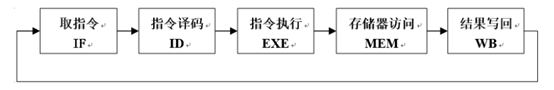

### 1.2 指令类型

#### MIPS 的三种指令类型

1. R 类型  
   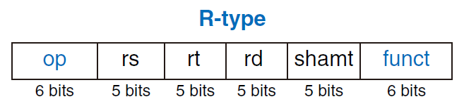
2. I 类型  
   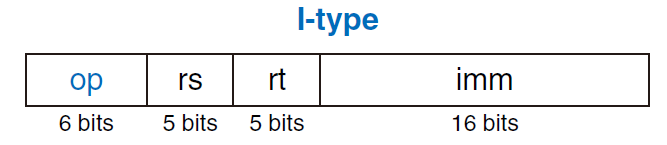
3. J 类型  
   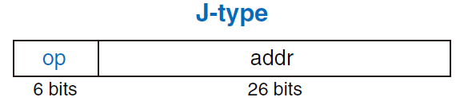

其中使用的符号释义如下：

- `op`: 为操作码
- `rs`: 为第1个源操作数寄存器, 寄存器地址 (编号) 是 `00000~11111`, `00~1F`
- `rt`: 为第2个源操作数寄存器, 或目的操作数寄存器, 寄存器地址 (同上)
- `rd`: 为目的操作数寄存器, 寄存器地址 (同上)
- `shamt`: 为位移量 (shift amt), 移位指令用于指定移多少位
- `funct`: 为功能码, 在寄存器类型指令中 (R类型) 用来指定指令的功能
- `imm`: 为 16 位立即数，用作无符号的逻辑操作数, 有符号的算术操作数, 数据加载 (Load)

### 1.3 控制线路图与数据通路

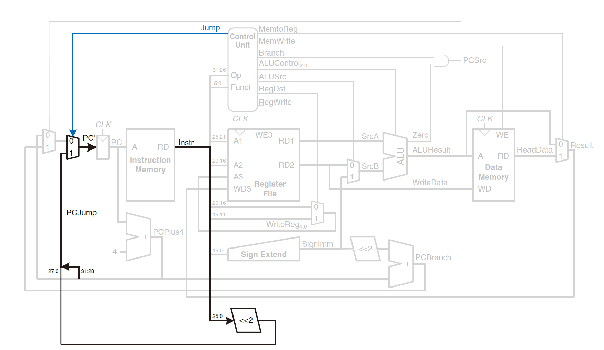

上图是一个简单的基本上能够在单周期上完成所要求设计的指令功能的数据通路和必要的控制线路图. 其中指令和数据各存储在不同存储器中, 即有指令存储器和数据存储器. 访问存储器时, 先给出地址, 然后由读 / 写信号控制 (1 - 写, 0 - 读. 当然, 也可以由时钟信号控制, 但必须在图上标出). 对于寄存器组, 读操作时, 先给出地址, 输出端就直接输出相应数据; 而在写操作时, 在 WE 使能信号为 1 时, 在时钟边沿触发写入.

### 1.4 控制信号

图中控制信号作用如下表所示 (在后来加指令的时候将所有的命名改写了)

| **控制信号** |               0               |               1               |
| :----------: | :---------------------------: | :---------------------------: |
|  `MemtoReg`  |    来自 ALU 运算结果的输出    |     来自数据存储器的输出      |
|  `Memwrite`  |         读指令存储器          |         写指令存储器          |
|   `Branch`   |         不是分支指令          |          是分支指令           |
|   `ALUSrc`   |    来自寄存器 `RD2` 的输出    |     来自立即数的符号扩展      |
|   `RegDst`   | 写寄存器组寄存器的地址来自 rt | 写寄存器组寄存器的地址来自 rd |
|  `RegWrite`  |      无写寄存器组寄存器       |        寄存器组写使能         |
|   `PCSrc`    |         `PC ← PC + 4`         |  `PC ← PC + 4 + SigImm * 4`   |
|    `Jump`    |          不是 J 指令          |            J 指令             |

## 2. MIPS 指令集

### 2.1 实现指令集

```assembly {.line-numbers}
add     $rd, $rs, $rt                   # [rd] = [rs] + [rt]
sub     $rd, $rs, $rt                   # [rd] = [rs] - [rt]
and     $rd, $rs, $rt                   # [rd] = [rs] & [rt]
or      $rd, $rs, $rt                   # [rd] = [rs] | [rt]
slt     $rd, $rs, $rt                   # [rd] = [rs] < [rt] ? 1 : 0
sll     $rd, $rt, shamt                 # [rd] = [rt] << shamt
srl     $rd, $rt, shamt                 # [rd] = [rt] >> shamt
sra     $rd, $rt, shamt                 # [rd] = [rt] >>> shamt
addi    $rt, $rs, imm                   # [rt] = [rs] + SignImm
andi    $rt, $rs, imm                   # [rt] = [rs] & ZeroImm
ori     $rt, $rs, imm                   # [rt] = [rs] | ZeroImm
slti    $rt, $rs, imm                   # [rt] = [rs] < SignImm ? 1 : 0
lw      $rt, imm($rs)                   # [rt] = [Address]
sw      $rt, imm($rs)                   # [Address] = [rt]
j       label                           # PC = JTA
jr      $rs                             # PC = [rs]
beq     $rs, $rt, label                 # if ([rs] == [rt]) PC = BTA
bne     $rs, $rt, label                 # if ([rs] != [rt]) PC = BTA
nop                                     # No operation
```

其中使用的符号释义如下：

- `[reg]`：寄存器 `$reg` 中的内容
- `imm`：I 类型指令的 16 位立即数字段
- `addr`：J 类型指令的 26 位地址字段
- `label`：指定指令地址的文本
- `SignImm`：32 位符号扩展的立即数（`= {{16{imm[15]}}, imm}`）
- `ZeroImm`：32 位 0 扩展的立即数（`= {16'b0, imm}`）
- `Address`：`[rs] + SignImm`
- `[Address]`：存储器单元 `Address` 地址中的内容
- `JTA`：跳转目标地址（`= {(PC + 4)[31:28], addr, 2'b0}`）
- `BTA`：分支目标地址（`= PC + 4 + (SignImm << 2)`）

### 2.2 对应机器码格式 [^2]

```text {.line-numbers}
add:    0000 00ss ssst tttt dddd d--- --10 0000
sub:    0000 00ss ssst tttt dddd d--- --10 0010
and:    0000 00ss ssst tttt dddd d--- --10 0100
or:     0000 00ss ssst tttt dddd d--- --10 0101
slt:    0000 00ss ssst tttt dddd d--- --10 1010
sll:    0000 00ss ssst tttt dddd dhhh hh00 0000
srl:    0000 00-- ---t tttt dddd dhhh hh00 0010
sra:    0000 00-- ---t tttt dddd dhhh hh00 0011
addi:   0010 00ss ssst tttt iiii iiii iiii iiii
andi:   0011 00ss ssst tttt iiii iiii iiii iiii
ori:    0011 01ss ssst tttt iiii iiii iiii iiii
slti:   0010 10ss ssst tttt iiii iiii iiii iiii
lw:     1000 11ss ssst tttt iiii iiii iiii iiii
sw:     1010 11ss ssst tttt iiii iiii iiii iiii
j:      0000 10aa aaaa aaaa aaaa aaaa aaaa aaaa
jr:     0000 00ss sss- ---- ---- ---- --00 1000
beq:    0001 00ss ssst tttt iiii iiii iiii iiii
bne:    0001 01ss ssst tttt iiii iiii iiii iiii
nop:    0000 0000 0000 0000 0000 0000 0000 0000
```

### 2.3 译码器表

#### 主译码器真值表

**instruct** | **operation** | **func** | branch | jump | reg_we | reg_write_addr | reg_write_data | alu_src_b | mem_we | alu_op | alu_src_a 
-| -| -| -| -| -| -| -| -| -| -| -
**R Type**| 6'b00_0000 | 6'bXX_XXXX | 00 | 00 | 1 | 1 | 0 | 0 | 0 | 111 | 0
  lw     | 6'b10_0011 | 6'bXX_XXXX | 00 | 00 | 1 | 0 | 1 | 1 | 0 | 000 | 0
  sw     | 6'b10_1011 | 6'bXX_XXXX | 00 | 00 | 0 | X | X | 1 | 1 | 000 | 0
  beq    | 6'b00_0100 | 6'bXX_XXXX | 10 | 00 | 0 | X | X | 0 | 0 | 001 | 0
  bne    | 6'b00_0101 | 6'bXX_XXXX | 01 | 00 | 0 | X | X | 0 | 0 | 001 | 0
  addi   | 6'b00_1000 | 6'bXX_XXXX | 00 | 00 | 1 | 0 | 0 | 1 | 0 | 000 | 0
  andi   | 6'b00_1100 | 6'bXX_XXXX | 00 | 00 | 1 | 0 | 0 | 1 | 0 | 010 | 0
  ori    | 6'b00_1101 | 6'bXX_XXXX | 00 | 00 | 1 | 0 | 0 | 1 | 0 | 011 | 0
  sll    | 6'b00_0000 | 6'b00_0000 | 00 | 00 | 1 | 0 | 0 | 1 | 0 | 100 | 1
  srl    | 6'b00_0000 | 6'b00_0010 | 00 | 00 | 1 | 0 | 0 | 1 | 0 | 101 | 1
  sra    | 6'b00_0000 | 6'b00_0011 | 00 | 00 | 1 | 0 | 0 | 1 | 0 | 110 | 1
   j     | 6'b00_0010 | 6'bXX_XXXX | XX | 01 | 0 | X | X | X | 0 | XXX | 0
  jr     | 6'b00_0000 | 6'b00_1000 | XX | 10 | 0 | X | X | X | 0 | XXX | 0

(由于 `nop` 就是 `sll` 的全 0 的情况, 因此不写了)

#### ALU 真值表

alu_op | alu_control | operation
-| - | -
000 | 010 | add
001 | 110 | sub
010 | 000 | and
011 | 001 | or
100 | 011 | sll
101 | 100 | srl
110 | 101 | sra
111 | XXX | func

## 3. 部件构成及实现代码

整个项目顶层文件 CPU 包含三个模块: `mips`, `DataMemoryDecoder`, `instr_mem`. 如下图所示

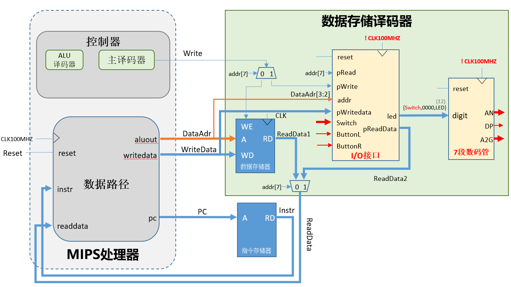

`mips`: 包单周期 CPU 的数据通路和控制模块

`DataMemoryDecoder`: 实现了将 I/O 接口的地址空间映像到存储器的部分地址空间

`instr_mem`: 作为系统的指令存储器

顶层模块 [**`cpu.sv`**](src/cpu.sv) 代码

### 3.1 `instr_mem`

[**`instr_mem.sv`**](src/instr_mem.sv) 代码

指令储存器内置了 64 个 32 位寄存器, 用于储存指令.

使用时从 `pc_addr` 读入指令地址 (`0x0` ~ `0x3F`), 从 `instr` 输出这个地址中的 32 位指令.

### 3.2 `mips`

[**`mips.sv`**](src/mips.sv) 代码

CPU 核心可分为两个部分: `control_unit` 和 `datapath`, 分别表示控制单元和数据通路.

#### `control_unit`

[**`control_unit.sv`**](src/control_unit.sv) 代码

控制单元负责解析输入的指令, 决定各个控制信号.

实现中, 先通过主译码器 `main_decoder` 解码, 对其中类型为 R-type 的指令再通过 ALU 译码器 `alu_decoder` 解码.

其在实现中将控制信号用变量 `controls` 捆绑后集中赋值, 省去了书写大量赋值语句的麻烦, 具体如下.

```verilog
assign {branch, jump, reg_we, reg_write_addr,
        reg_write_data, alu_src_b, mem_we, alu_op, alu_src_a} = controls;

always_comb begin
6'b10_0011: controls = 13'b0000_1011_0000_0; // lw
6'b10_1011: controls = 13'b0000_0XX1_1000_0; // sw
// ...
// ...
end
```

#### `datapath`

[**`datapath.sv`**](src/datapath.sv) 代码

数据通路负责传递 MIPS 中所有的数据.

其中由于部件过多, 这里不一一解释其作用, 只放代码

1. `alu.sv`

   ```verilog
   // alu.sv
   module alu #(parameter Width = 32)(
       input   [Width-1:0] a_i,
       input   [Width-1:0] b_i,
       input   [2:0]      alu_control_i,
       output  logic   [Width-1:0] result_o,
       output  logic               zero
   );
       always_comb begin
           case(alu_control_i)
               3'b000:   result_o = a_i & b_i;     // 0: and
               3'b001:   result_o = a_i | b_i;     // 1: or
               3'b010:   result_o = a_i + b_i;     // 2: add
               3'b011:   result_o = a_i << b_i;    // 3: sll
               3'b100:   result_o = a_i >> b_i;    // 4: srl
               3'b101:   result_o = a_i >>> b_i;   // 5: sra
               3'b110:   result_o = a_i - b_i;     // 6: sub
               3'b111:   result_o = a_i < b_i;     // 7: slt
           default: result_o = 3'd0;
           endcase
       end
   
       assign zero = !result_o;
   
   endmodule
   ```
   算术逻辑单元 (ALU), 用于加减, 位运算等算术操作.

   ALU 根据 `alu_control_i` 信号决定对操作数 A 和 B 进行何种运算, 从 `result_o` 输出运算结果, 从 `zero` 输出结果是否为 `0`. 其中 `alu_control_i` 由控制单元根据 `alu_op` 和 `func` 决定. 具体映射表在前已有描述

2. `flip_flop`

   ```verilog
   // utility.sv
   // flip flop
   module flip_flop (
       input   logic   clk, rst,
       input   logic   [31:0]in,
       output  logic   [31:0]out
   );
       always_ff @(posedge clk, posedge rst) begin
           if(rst)
               out <= 0;
           else
               out <= in;
       end
   endmodule
   ```

   触发器, 用于储存 PC.

   在时钟上升沿将新的 PC 值 `in` 写入. 当重置信号 `rst` 为 `1` 时, 将 PC 异步清零.

3. `register_file.sv`

   ```verilog
   // register_file.sv
   module register_file (
       input   logic   clk, we,
       input   logic   [4:0]r_addr_1,
       input   logic   [4:0]r_addr_2,
       input   logic   [4:0]w_addr,
       input   logic   [31:0]write_data,
       output  logic   [31:0]rd_data_1,
       output  logic   [31:0]rd_data_2
   );
       logic [31:0] RegFile[31:0];
   
       always_ff @(posedge clk) begin
           if(we)
               RegFile[w_addr] <= write_data;
       end
   
       assign rd_data_1 = r_addr_1? RegFile[r_addr_1]: 0;
       assign rd_data_2 = r_addr_2? RegFile[r_addr_2]: 0;
   endmodule
   ```

   寄存器文件内置了 `32` 个 `32` 位寄存器, 用于读写临时数据.

   使用时从 `r_addr_1` 和 `r_addr_2` 分别读入地址 (`0x0 ~ 0x1F`) 以指定寄存器, 然后从 `rd_data_1` 和 `rd_data_2` 分别输出对应寄存器中的 `32` 位数据. 其中 `0` 号寄存器的值始终为 `0`, 因此在实现中直接返回 `0`. 当写使能 `we` 为 `1` 时, 在时钟上升沿将数据 `write_data` 写入地址 `w_addr` 指定的寄存器. 当重置信号 `rst` 为 `1` 时, 清空所有寄存器中的数据.

4. `sign_extension`

   ```verilog
   // utility.sv
   // signal extension
   module sign_extension #(
       parameter Width = 16
   )(
       input   logic   [Width-1:0]in,
       output  logic   [31:0]out
   );
       assign out = {{(32-Width){in[Width-1]}}, in};
   endmodule
   ```

   符号扩展模块的作用是将 `16` 位的立即数符号扩展至 `32` 位.

   使用时从 `in` 读入待扩展的数据, 从 `out` 输出扩展后的数据.

5. adder

   ```verilog
   // utility.sv
   // adder
   module adder (
       input   logic   [31:0] a,
       input   logic   [31:0] b,
       output  logic   [31:0] result
   );
       assign result = a + b;
   endmodule
   ```

   `32` 位加法器, 用于计算 PC 值及跳转地址.

   使用时读入 `a` 和 `b`，从 `result` 输出 `a` 和 `b` 相加后的值.

### 3.3 `DataMemoryDecoder`

[**`DataMemoryDecoder.sv`**](src/IO/DataMemoryDecoder.sv) 代码

`DataMemoryDecoder` 主要实现了将 I/O 接口的地址空间映像到存储器的部分地址空间, 最后的结果可以在板子上显示, 具体图片见下测试代码中.

#### `data_mem`

[**`data_mem.sv`**](src/data_mem.sv) 代码

数据储存器内置了 `256` 个 32 位的数据段 (初始只有 `64` 个的数据段,  后由于需要在高位给 I/O 提供接口, 因此拓展了大小), 用于读写大量数据. 其特点是容量大, 但读写速度慢 (相较于寄存器)

当写使能 `we` 为 `1` 时, 在时钟上升沿将数据 `write_data`写入地址 `data_addr`; 当写使能 `we` 为 `0` 时, 将地址 `data_addr` 中的数据读入到 `read_data` 中.

#### `IOport`

[**`IOport.sv`**](src/IO/IOport.sv) 代码

`IOport` 负责将板子中的输入写入主存中的 I/O 接口中, 并将主存 I/O 接口中的数据读出传递给七段数码管.

实现细节见代码注释.

#### `mux7seg`

[**`mux7seg.sv`**](src/IO/mux7seg.sv) 代码

这边就是非常老实的用了老师给的代码段 (由于显示的代码和单周期 CPU 没啥关系就不写解释了)
## 4. 测试代码

### 4.1 `regFile` 测试

```sv
module test_regFile();
  logic        clk;
  logic        regWriteEn;
  logic [4:0]  regWriteAddr;
  logic [31:0] regWriteData;
  logic [4:0]  RsAddr;
  logic [4:0]  RtAddr;
  logic [31:0] RsData;
  logic [31:0] RtData;

  regfile regfile(clk, regWriteEn, RsAddr, RtAddr, regWriteAddr, regWriteData, RsData, RtData);
  

  initial begin
    clk = 0;
    regWriteEn = 0;
    regWriteAddr = 0;
    regWriteData = 0;
    RsAddr = 0;
    RtAddr = 0;
    #100;
    regWriteEn = 1;
    regWriteData = 32'h1234abcd;
  end

  parameter PERIOD = 20;
  always begin
    clk = 1'b0;
    #(PERIOD / 2) clk = 1'b1;
    #(PERIOD / 2);
  end

  always begin
    regWriteAddr = 8;
    RsAddr = 8;
    #PERIOD;
  end
endmodule
```

仿真结果如下所示:


结果同 PPT 中截图一样

### 3.2 `testbench` 书上测试代码

```sv
// testbench.sv
`timescale 1ns / 1ps

module testbench();

  logic clk;
  logic reset;

  logic [31:0] writedata, dataadr;
  logic        memwrite;
  
  //instantiate device to be tested
  top dut(clk, reset, writedata, dataadr, memwrite);
  
  //initialize test
  initial
    begin
      reset <= 1; #22; reset <= 0;
    end
  
  //generate clock to sequence tests
  always
    begin
      clk <= 1; #5; clk <= 0; #5;
    end
  
  //check results
  always @(negedge clk)
    begin
      if(memwrite) begin
        if(dataadr === 84 & writedata === 7) begin
          $display("Simulation succeeded");
          $stop;
        end else if(dataadr !== 80) begin
            $display("Simulation failed");
            $stop;
          end
        end
      end
endmodule
```

对应的机器代码

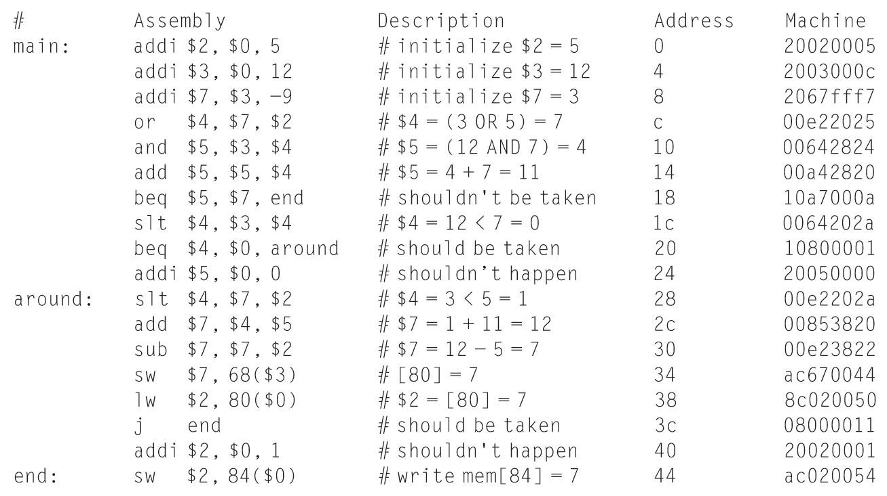

仿真结果如下:

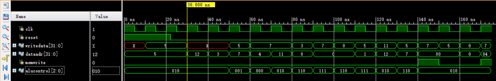

### 3.3 IO 测试

```sv
// IO_test.sv
`timescale 1ns / 1ps

module testbench();

    logic clk;
    logic  reset;
    logic  L,R;
    logic [15:0]SW;
    logic [7:0]AN;
    logic DP;
    logic [6:0]A2G;
    
    cpu dut(clk,reset,L,R,SW,AN,DP,A2G);

    initial begin
           SW <= 16'h1234;
           reset <=1;
           #50;
           reset <=0;
           #50;
           R <= 1;
           #50;
           R <= 0;
           #200;
           L <= 1;
           #50;
           L <= 0;
	end

    always begin
        clk <= 1;
        #5;
        clk <= 0;
        #5;
    end
endmodule
```

仿真结果如下:

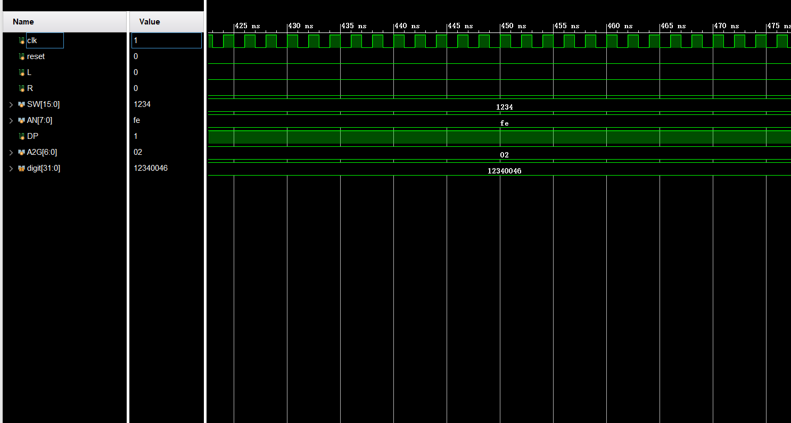

实物图如下:

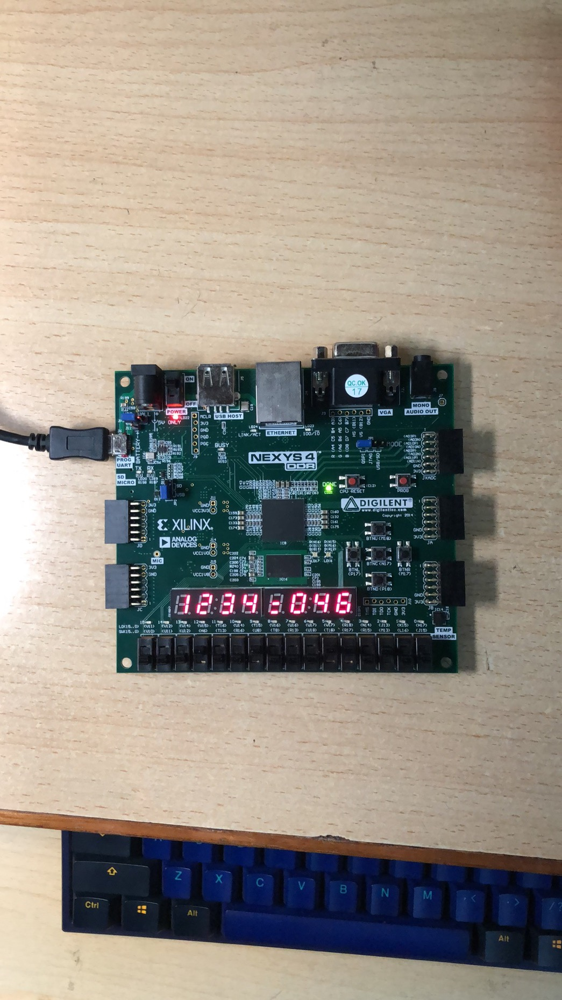

#### 调试中遇到的问题

注意到不能将 .dat 后缀换为其他格式, 否则指令将无法读入.

### 3.4 新增代码测试

```sv
`timescale 1ns / 1ps

module testbench();

    logic clk;
    logic  reset;
    logic  [31:0] writedata,dataadr;
    logic  memwrite;

    initial begin
        reset <= 1;
        #22;
        reset <= 0;
    end

    cpu dut(clk,reset,dataadr,writedata, memwrite);

    always begin
        clk <= 1;
        #1;
        clk <= 0;
        #1;
    end
endmodule
```

对应机器代码

```asm
main:   addi    $t0, $0, 5      ; initialize $t0 = 5            20080005
        addi    $t1, $0, 12     ; initialize $t1 = 12           2009000c
        addi    $t2, $t1, -9    ; initialize $t2 = 3            212afff7
        ori     $t3, $t0, 2     ; initialize $t3 = 7            350b0002
        andi    $t4, $t0, 7     ; initialize $t4 = 5            310c0007
        addi    $t5, $0, -7     ; initialize $t5 = -7           200dfff9
        sub     $t0, $t3, $t2   ; set $t0 = $t3 - $t2 = 4       016a4022
        add     $t1, $t3, $t2   ; set $t1 = $t3 + $t2 = 10      016a4820
        or      $t2, $t0, $t2   ; set $t2 = $t1 | $t2 = 7       010a5025
        and     $t3, $t0, $t3   ; set $t3 = $t1 & $t3 = 4       010b5824
        sll     $t0, $t0, 2     ; set $t0 = $t0 << 2 = 16       00084080
        srl     $t2, $t2, 2     ; set $t2 = $t2 >> 2 = 1        000a5082
        sra     $t5, $t5, 1     ; set $t5 = $t5 >>> 1 = -3      000d6843
        beq     $t0, $t3, end   ; shouldn't be taken            110b0007
        slt     $t0, $t0, $t1   ; set $t0 = $t0 < $t1 = 0       0109402a
        bne     $t0, $t1, around; should be taken               15090001
        addi    $t5, $t5, 3     ; should not happen             21ad0003

around: sw      $t5, 70($t1)    ; mem[80] = -3                  ad2d0046
        lw      $t0, 80($0)     ; $t0 = mem[80] = -3            8c080050
        j jump                  ; jump to jump                  08000054
        andi    $t1, $t1, 0     ; should not happen             31290000

jump:   addi    $t1, $0, 96     ; set $t1 = end                 20090060
        jr      $t1             ; jump to end                   01200008
        addi    $t5, $t5, 5     ; shouldn't taken               21ad0005

end:    sw      $t5, 84($0)     ; mem[84] = $2 = -3             ac0d0054
```

仿真结果如下:

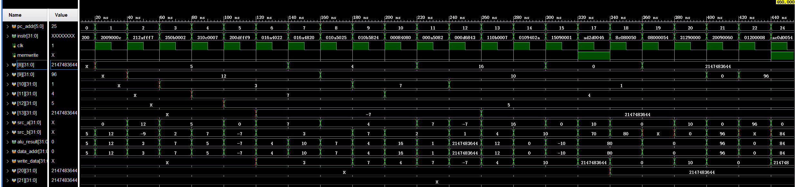

这里的 2147xxxx 理应是 -3, 这里是 vivado 把 `>>>` 识别成 `>>` 导致的结果, 所以应该不是我代码的问题